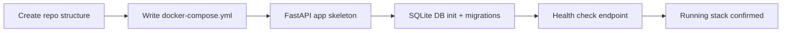

# Agent Briefing: Project Scaffolding

## Round: 1
## Project: Evenly

## Context
Evenly is a self-hosted household management tool running on a GreenNAS DXP2800 via Docker Compose.
It helps multi-person households replace reactive cleaning with short daily routines (15–30 min).
The stack is Python + FastAPI (backend), SQLite (database), Vue.js + Vuetify (frontend).
This round establishes the complete project foundation — no business logic yet, just the skeleton everything else builds on.

## Area
Infrastructure — folder structure, Docker Compose setup, FastAPI skeleton, SQLite initialization

## Workflow Reference


## Tasks
- [ ] Create project folder structure:
  ```
  evenly/
  ├── backend/
  │   ├── app/
  │   │   ├── main.py
  │   │   ├── database.py
  │   │   ├── models/
  │   │   ├── routers/
  │   │   └── agents/
  │   ├── requirements.txt
  │   └── Dockerfile
  ├── frontend/
  │   └── (scaffolded in R9)
  ├── docker-compose.yml
  └── .env.example
```
- [ ] Write `docker-compose.yml` with backend service (port 8000), volume for SQLite file
- [ ] Create FastAPI `main.py` with app init, CORS config, and router placeholder
- [ ] Create `database.py` with SQLite connection using SQLAlchemy + session management
- [ ] Create initial DB schema migration (empty tables, just structure ready)
- [ ] Add `GET /health` endpoint returning `{ "status": "ok", "version": "0.1.0" }`
- [ ] Write `requirements.txt` with: fastapi, uvicorn, sqlalchemy, alembic, python-dotenv, anthropic, httpx
- [ ] Write `.env.example` with placeholder keys: `CLAUDE_API_KEY`, `GOOGLE_CLIENT_ID`, `GOOGLE_CLIENT_SECRET`

## Expected Output
- [ ] `docker-compose.yml` — runnable with `docker compose up`
- [ ] `backend/app/main.py` — FastAPI app boots without errors
- [ ] `backend/app/database.py` — SQLite connection working
- [ ] `GET /health` returns 200 OK
- [ ] Folder structure matches spec above
- [ ] `.env.example` with all required keys documented

## Boundaries
- NOT: Implement any business logic (tasks, users, scoring)
- NOT: Build any frontend
- NOT: Connect to Claude API or Google Calendar yet
- NOT: Add authentication (comes later if needed)

## Done When
- [ ] `docker compose up` starts without errors
- [ ] `GET http://localhost:8000/health` returns `{ "status": "ok" }`
- [ ] SQLite file is created in the volume on first start
- [ ] Folder structure is complete and consistent

## Technical Specifications
- Backend: Python 3.11+ + FastAPI
- Database: SQLite via SQLAlchemy (ORM) + Alembic (migrations)
- Deployment: Docker Compose on GreenNAS DXP2800
- Port: 8000 (backend API)
- Environment variables via `.env` file (python-dotenv)

---

## QA
After this round is complete, run the **QA Agent** (`agents/qa-agent.md`).

**QA report output:** `projects/evenly/qa/qa-report-r1.md`

**Key checks for this round:**
- `docker compose up` starts without errors
- `GET /health` returns `{ "status": "ok", "version": "0.1.0" }`
- SQLite file created in volume on first start
- Folder structure matches briefing spec exactly
- No credentials or hardcoded values in any file
- `.env.example` contains all required keys
