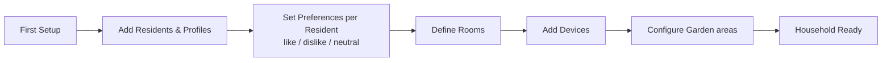

# Agent Briefing: Household Configuration

## Round: 2
## Project: Evenly

## Context
Evenly is a self-hosted household management tool. The stack is Python + FastAPI + SQLite.
The project scaffold from Round 1 is complete and running.
This round implements everything needed to configure a household: residents, rooms, devices, and per-resident preferences.
This is the foundational data layer — every other feature depends on it.

## Area
Area A — Household Configuration

## Workflow Reference

## Tasks

### Data Models (SQLAlchemy)
- [ ] `Household` — name, created_at, plus the following boolean flags:

  **Composition flags** (control which catalog tasks are visible):
  - `has_children` (bool) — enables child-related tasks
  - `has_cats` (bool) — enables cat-related tasks
  - `has_dogs` (bool) — enables dog-related tasks
  - `has_garden` (bool) — enables garden-related tasks

  **Appliance / device capability flags** (influence task scoring and variants):
  - `has_robot_vacuum` (bool) — reduces manual vacuuming frequency; preferred at low energy
  - `has_robot_mop` (bool) — reduces manual mopping frequency; preferred at low energy
  - `has_dishwasher` (bool) — replaces "hand wash dishes" with "empty dishwasher"
  - `has_washer` (bool) — enables laundry tasks
  - `has_dryer` (bool) — changes "hang laundry" to "move to dryer"
  - `has_window_cleaner` (bool) — enables window cleaning tasks
  - `has_steam_cleaner` (bool) — enables deep-clean tile/grout tasks
  - `has_robot_mower` (bool) — reduces manual mowing; preferred at low energy (garden only)
  - `has_irrigation` (bool) — removes "water plants/garden" from suggestions (garden only)

  **Important robot logic (implemented in R4 scoring engine):**
  - Robot vacuum/mop present → manual floor tasks remain but frequency reduced
  - Robot vacuum/mop present + energy=low → robot task strongly preferred over manual
  - Robot ran recently → manual floor task temporarily suppressed

- [ ] `Resident` — name, display_name, color/avatar, household_id, role (admin/edit/view), pin_hash, created_at
- [ ] `Room` — name, type (kitchen/bathroom/bedroom/living/garden/other), household_id, active (bool)
- [ ] `Device` — name, type (vacuum/washer/dryer/dishwasher/window_cleaner/other), room_id, household_id, notes
- [ ] `ResidentPreference` — resident_id, task_category (string), preference (like/neutral/dislike)

**Role definitions (to be fully implemented in R2b):**
- `admin` — full access: manage residents, roles, household config, all edit rights
- `edit` — manage task catalog (activate/deactivate/create tasks), all view rights
- `view` — participate fully (sessions, tasks, gamification), no configuration access

**PIN concept (to be fully implemented in R2b):**
- Each resident has a 4-digit PIN set at creation time
- PIN is hashed before storage (bcrypt) — never stored as plain text
- PIN required to perform admin/edit actions
- Full PIN auth flow implemented in R2b — in R2, only store the hashed PIN field

### API Endpoints (FastAPI routers)
- [ ] `POST /residents` — create resident (requires: name, display_name, role, pin) — admin only
- [ ] `GET /residents` — list all residents (public — needed for resident switcher)
- [ ] `PUT /residents/{id}` — update resident (admin only for role changes, edit/admin for other fields)
- [ ] `POST /rooms` — create room
- [ ] `GET /rooms` — list all rooms
- [ ] `PUT /rooms/{id}` — update / deactivate room
- [ ] `POST /devices` — create device
- [ ] `GET /devices` — list devices
- [ ] `PUT /devices/{id}` — update device
- [ ] `POST /residents/{id}/preferences` — set preference for a task category
- [ ] `GET /residents/{id}/preferences` — get all preferences for a resident

### Seed Data
- [ ] Seed script with example household: 2 residents, common rooms (Kitchen, Living Room, Bathroom, Bedroom, Hallway, Children's Room, Garden), common devices (Vacuum Robot, Washing Machine, Dryer, Dishwasher, Window Cleaner)

## Expected Output
- [ ] All 5 data models created and migrated to SQLite
- [ ] All API endpoints working and returning correct JSON
- [ ] Seed script runnable with `python seed.py`
- [ ] Alembic migration file for this round

## Boundaries
- NOT: Build any UI (comes in R9)
- NOT: Implement task catalog (R3)
- NOT: Implement full PIN verification / role enforcement (comes in R2b)
- NOT: Hard-code household structure — all data must be configurable via API

## Done When
- [ ] `POST /residents` creates a resident and returns it with an ID
- [ ] `GET /rooms` returns seeded rooms
- [ ] `POST /residents/{id}/preferences` saves a like/dislike/neutral preference
- [ ] All models visible in SQLite DB after seed script runs

## Technical Specifications
- Backend: Python + FastAPI
- Database: SQLite via SQLAlchemy + Alembic
- Preference values: enum — `like`, `neutral`, `dislike`
- Room types: enum — `kitchen`, `bathroom`, `bedroom`, `living`, `hallway`, `childrens_room`, `garden`, `other`
- Device types: enum — `vacuum`, `washer`, `dryer`, `dishwasher`, `window_cleaner`, `other`
- Roles: enum — `admin`, `edit`, `view`
- PIN: stored as bcrypt hash in `pin_hash` field — add `bcrypt` to requirements.txt
- First resident created is automatically assigned role `admin`
- All IDs: integer primary keys (simple, sufficient for household scale)

---

## QA
After this round is complete, run the **QA Agent** (`agents/qa-agent.md`).

**QA report output:** `projects/evenly/qa/qa-report-r2.md`

**Key checks for this round:**
- All 5 models exist in DB after migration
- `POST /residents` creates a resident with hashed PIN (never plain text)
- `GET /rooms` returns seeded rooms with correct types
- `POST /residents/{id}/preferences` saves like/dislike/neutral correctly
- First resident created receives role `admin` automatically
- Seed script runs without errors
