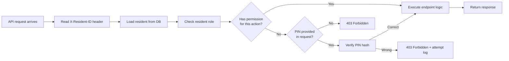

# Agent Briefing: Roles & Access Control

## Round: 2b
## Project: Evenly

## Context
Evenly is a self-hosted household management tool. Round 2 is complete:
residents exist in the DB with a `role` field (admin/edit/view) and a `pin_hash` field.
This round implements the full access control layer — PIN verification, role enforcement on all API endpoints,
and the foundation for future upgrades (e.g. proper JWT login, 2FA) without breaking existing code.
This is a security and authorization round — no new features, only enforcement of existing role structure.

## Area
Area A (extension) — Roles & Access Control

## Workflow Reference

## Role Definitions

| Role | Permissions |
|------|-------------|
| `admin` | All actions — manage residents, assign roles, configure household, edit catalog, participate |
| `edit` | Manage task catalog (activate/deactivate/create/edit tasks) + all `view` permissions |
| `view` | Participate fully — sessions, task suggestions, complete tasks, gamification, feed, profile |

## Tasks

### PIN Verification
- [ ] Add `bcrypt` to `requirements.txt` (if not already added in R2)
- [ ] `POST /auth/verify-pin` — body: `{ resident_id, pin }` → returns `{ valid: true/false, role: "..." }`
  - Hash provided PIN with bcrypt, compare to stored `pin_hash`
  - Log failed attempt to `PINAttemptLog` table
  - After 3 failed attempts within 10 minutes: return 429 with `retry_after` seconds
- [ ] `POST /residents/{id}/change-pin` — body: `{ current_pin, new_pin }` — any role, own PIN only
- [ ] `POST /residents/{id}/reset-pin` — admin only, no current PIN required (for lockout recovery)

### Data Models
- [ ] `PINAttemptLog` — id, resident_id, attempted_at, success (bool), ip_address
- [ ] No new models needed — role + pin_hash already on `Resident` from R2

### FastAPI Dependency: Role Guard
- [ ] Create `backend/app/auth.py` with reusable FastAPI dependencies:
  - `get_active_resident(x_resident_id: int = Header(...))` — reads resident from DB, raises 401 if not found
  - `require_role(minimum_role: str)` — factory that returns a dependency checking role level
  - `require_pin_or_role(minimum_role: str)` — allows either correct role OR valid PIN provided in same request
- [ ] Role hierarchy: `admin > edit > view` (admin can do everything edit can, edit can do everything view can)

### Apply Guards to Existing Endpoints
Apply the appropriate dependency to every existing endpoint:

**Admin only:**
- [ ] `POST /residents` — create resident
- [ ] `PUT /residents/{id}` — update role field
- [ ] `POST /rooms`, `PUT /rooms/{id}`
- [ ] `POST /devices`, `PUT /devices/{id}`
- [ ] `POST /calendar/auth`, `PUT /calendar/config`
- [ ] `POST /catalog/generate` — regenerate catalog
- [ ] `POST /residents/{id}/reset-pin`

**Edit + Admin:**
- [ ] `POST /catalog` — create custom task
- [ ] `PUT /catalog/{id}` — edit task (duration, frequency, active status)
- [ ] `DELETE /catalog/{id}` — delete custom task

**View + Edit + Admin (all residents):**
- [ ] `POST /sessions`, `GET /sessions/{id}/suggestions`
- [ ] `POST /sessions/{id}/reroll`
- [ ] `POST /assignments/{id}/accept`, `/complete`, `/skip`, `/delegate`
- [ ] `GET /feed`, `GET /history`
- [ ] `GET /residents/{id}/stats`, `GET /household/stats`
- [ ] `GET /residents/{id}/game-profile`, `GET /vouchers`, `POST /vouchers/{id}/redeem`
- [ ] `POST /panic`, `GET /panic/{id}`, `POST /panic/{id}/complete`
- [ ] `POST /residents/{id}/change-pin` (own PIN only)
- [ ] `POST /residents/{id}/preferences`, `GET /residents/{id}/preferences`

**Public (no auth required):**
- [ ] `GET /health`
- [ ] `GET /residents` — needed for resident switcher UI
- [ ] `GET /catalog` — reading the catalog is public (editing is edit/admin)
- [ ] `GET /calendar/callback` — OAuth2 redirect handler

### Request Convention
- Active resident identified via HTTP header: `X-Resident-ID: {id}`
- PIN (when required) passed via header: `X-Resident-PIN: {4-digit-pin}` — only for the verify endpoint
- All other endpoints check role from DB — no PIN sent on every request
- PIN session managed client-side (30 min in-memory, see R9) — backend is stateless per request

## Expected Output
- [ ] `backend/app/auth.py` with `get_active_resident`, `require_role`, `require_pin_or_role` dependencies
- [ ] `POST /auth/verify-pin` returns correct valid/invalid response
- [ ] All endpoints from the list above have correct role guard applied
- [ ] 3 failed PIN attempts within 10 min returns 429
- [ ] Admin can reset another resident's PIN
- [ ] View-role resident gets 403 when calling `POST /rooms` without PIN

## Boundaries
- NOT: Implement JWT tokens or session cookies — header-based resident ID is sufficient for v1.0
- NOT: Implement email-based password reset — admin PIN reset is sufficient
- NOT: Add rate limiting beyond PIN attempt throttling
- NOT: Change any existing endpoint behavior — only add authorization guards
- NOT: Hard-code any resident ID or role — always read from DB

## Done When
- [ ] `POST /auth/verify-pin` with correct PIN returns `{ valid: true }`
- [ ] `POST /rooms` with `X-Resident-ID` of a view-role resident returns 403
- [ ] `POST /rooms` with `X-Resident-ID` of an admin resident returns 201
- [ ] 3 wrong PIN attempts within 10 min returns 429 on 4th attempt
- [ ] `GET /residents` remains public (no auth header required)

## Technical Specifications
- Backend: Python + FastAPI
- PIN hashing: `bcrypt` — `bcrypt.hashpw(pin.encode(), bcrypt.gensalt())`
- Role hierarchy enforced as ordered list: `["view", "edit", "admin"]` — index comparison
- `X-Resident-ID` header: integer, required on all protected endpoints
- PIN attempt throttle: check `PINAttemptLog` — count failures in last 10 minutes per resident
- Future upgrade path: replace `get_active_resident` dependency with JWT-based version — all guards remain unchanged

---

## QA
After this round is complete, run the **QA Agent** (`agents/qa-agent.md`).

**QA report output:** `projects/evenly/qa/qa-report-r2b.md`

**Key checks for this round:**
- `POST /auth/verify-pin` returns `{ valid: true }` with correct PIN
- `POST /rooms` with view-role resident returns 403
- `POST /rooms` with admin-role resident returns 201
- 3 wrong PIN attempts within 10 min → 4th attempt returns 429
- `pin_hash` never appears in any API response body
- `GET /residents` and `GET /health` accessible without `X-Resident-ID` header
- All endpoints from the permission table have guards applied

> **Milestone 1 follows this round.**
> After QA passes, run the **Review Agent** (`agents/review-agent.md`) for Milestone 1.
> Review report output: `projects/evenly/qa/review-report-milestone-1.md`
