# Agent Briefing: Task Catalog

## Round: 3
## Project: Evenly

## Context
Evenly is a self-hosted household management tool. Rounds 1 and 2 are complete:
the scaffold runs, household configuration (residents, rooms, devices, preferences) is in place.
This round generates and stores the task catalog — the library of all household tasks the system will suggest.
The catalog is generated ONCE via the Claude API (claude-sonnet) at setup time, stored in SQLite, and never regenerated unless manually triggered.
All values are pre-filled by AI and fully editable by residents afterwards.

## Area
Area B — Task Catalog

## Workflow Reference

```mermaid
flowchart LR
    Catalog[Trigger catalog generation] --> Claude[Call Claude API\nclaude-sonnet]
    Claude --> Parse[Parse structured JSON response]
    Parse --> Store[Store tasks in SQLite]
    Store --> Review[Export catalog for human review]
    Review --> Feedback[Owner reviews + adds missing tasks]
    Feedback --> Finalize[Finalize catalog]
    Finalize --> Browse[Browse by Room & Category]
    Browse --> Toggle[Activate / Deactivate tasks]
    Toggle --> Edit[Edit duration, frequency, energy level]
    Edit --> Custom[Add custom tasks manually]
    Custom --> Ready[Catalog ready]
```

## Tasks

### Data Model
- [ ] `TaskTemplate` — id, name, description, room_type, category, default_duration_minutes, default_frequency_days, energy_level (low/medium/high), is_active (bool), is_custom (bool), household_flag, device_flag, is_robot_variant (bool), robot_frequency_multiplier (float), created_at
- [ ] `category` values: cleaning, tidying, laundry, garden, decluttering, maintenance, other

**`household_flag` field** (composition-based visibility):
- `null` — task always shown
- `children` — only shown when `household.has_children = true`
- `cats` — only shown when `household.has_cats = true`
- `dogs` — only shown when `household.has_dogs = true`
- Flagged tasks default to `is_active = false`; activated automatically when household flag is toggled on

**`device_flag` field** (appliance-based visibility):
- `null` — task always shown
- `robot_vacuum` — only shown when `household.has_robot_vacuum = true`
- `robot_mop` — only shown when `household.has_robot_mop = true`
- `dishwasher` — only shown when `household.has_dishwasher = true`
- `washer` — only shown when `household.has_washer = true`
- `dryer` — only shown when `household.has_dryer = true`
- `window_cleaner` — only shown when `household.has_window_cleaner = true`
- `steam_cleaner` — only shown when `household.has_steam_cleaner = true`
- `robot_mower` — only shown when `household.has_robot_mower = true`
- `irrigation` — only shown when `household.has_irrigation = true`

**`is_robot_variant` + `robot_frequency_multiplier` fields** (robot scoring logic):
- Manual floor tasks (vacuum, mop) have a paired robot variant task
- Manual task: `is_robot_variant = false`, `robot_frequency_multiplier` = e.g. 0.4 (means 60% less often when robot present)
- Robot task: `is_robot_variant = true`, `device_flag = robot_vacuum/robot_mop`
- The scoring engine in R4 applies `robot_frequency_multiplier` to reduce manual task frequency when the corresponding device flag is true
- At `energy=low`: robot task receives a large score boost; manual task receives a malus

**In the UI:** device-flagged tasks grouped in settings under their appliance type. Toggling a household device flag auto-activates/deactivates the group.

### Catalog Agent (Python)
- [ ] Create `backend/app/agents/catalog_agent.py`
- [ ] Build prompt for Claude API that requests a comprehensive household task catalog:
  - Organized by room type and category
  - Each task includes: name, description, duration (minutes), frequency (days), energy level, household_flag, device_flag, is_robot_variant, robot_frequency_multiplier
  - Granular tasks — not "clean kitchen" but "wipe kitchen cabinet fronts", "clean oven interior", "descale kettle", etc.
  - For every manual floor task (vacuum, mop): generate a paired robot variant (e.g. "Vacuum floors manually" + "Start robot vacuum")
  - For dishwasher: generate "Empty dishwasher" (device_flag=dishwasher) alongside or instead of "Hand wash dishes"
  - Include flagged tasks for children, cats, dogs (e.g. "Clean baby changing mat", "Clean litter box", "Wash dog bed")
  - Include garden tasks only with device variants where applicable (robot mower, irrigation)
  - Minimum 10 tasks per room type for base catalog, plus 5+ flagged tasks per flag/device type
  - 120+ tasks total (base + flagged + device variants)
  - Response must be valid JSON (use structured output / JSON mode)
- [ ] Parse Claude API JSON response
- [ ] Insert all tasks into `TaskTemplate` table with `is_active = true` by default for base tasks
- [ ] Insert flagged tasks with `is_active = false` by default (activated when household flag is toggled on)
- [ ] Log generation summary: how many tasks per room, how many per flag, total count

### Catalog Review Step (human-in-the-loop)
- [ ] `GET /catalog/export` — export full catalog as structured JSON or Markdown for human review
  - Groups tasks by room_type → category → household_flag
  - Includes all fields: name, description, duration, frequency, energy_level, household_flag, is_active
- [ ] After generation, the agent must print a review prompt:
  *"Catalog generated. Review the export at GET /catalog/export before finalizing. Add custom tasks via POST /catalog if needed."*
- [ ] Review is complete when the household owner confirms — no automatic finalization

### API Endpoints
- [ ] `POST /catalog/generate` — trigger one-time catalog generation via Claude API (idempotent: skip if catalog already exists)
- [ ] `GET /catalog` — list all tasks, filterable by: `room_type`, `category`, `is_active`, `household_flag`
  - Automatically filters out flagged tasks when household flag is `false` (checks household config)
  - Optional param `?include_flagged=true` to show all tasks regardless of household flags (for settings screen)
- [ ] `GET /catalog/export` — export full catalog as JSON for human review (groups by room → category → flag)
- [ ] `PUT /catalog/{id}` — edit any field of a task (duration, frequency, energy level, name, active status)
- [ ] `POST /catalog` — create a custom task manually (supports `household_flag` field)
- [ ] `DELETE /catalog/{id}` — delete a custom task (pre-generated tasks: deactivate only, not delete)

## Expected Output
- [ ] `catalog_agent.py` with Claude API integration
- [ ] `POST /catalog/generate` populates DB with 100+ base tasks + flagged tasks
- [ ] Tasks structured by room, category, and household_flag
- [ ] `GET /catalog?room_type=kitchen` returns only kitchen tasks
- [ ] `GET /catalog` filters out flagged tasks when household flag is false
- [ ] `GET /catalog/export` returns full human-readable catalog grouped by room → category → flag
- [ ] `PUT /catalog/{id}` with `{ "is_active": false }` deactivates a task
- [ ] Custom tasks creatable via `POST /catalog` with optional `household_flag`
- [ ] Flagged tasks default to `is_active = false` on generation

## Boundaries
- NOT: Build suggestion logic (R4)
- NOT: Assign tasks to residents
- NOT: Call Claude API more than once for the same household (check before generating)
- NOT: Hard-code any task list — all tasks must come from Claude or be user-created

## Done When
- [ ] `POST /catalog/generate` returns summary with task count per room and per flag type
- [ ] SQLite contains 100+ TaskTemplate rows after generation (base + flagged)
- [ ] Tasks have valid duration, frequency, energy_level, and household_flag values
- [ ] Flagged tasks have `is_active = false` by default
- [ ] `GET /catalog` hides cats tasks when `household.has_cats = false`
- [ ] `GET /catalog/export` returns grouped, human-readable full catalog
- [ ] Deactivating a task via API persists correctly

## Technical Specifications
- AI: Claude API, model `claude-sonnet` (latest available via Anthropic SDK)
- Claude call: one-time, triggered manually at setup
- Response format: JSON array of task objects
- Energy level: enum — `low`, `medium`, `high`
- Frequency: integer (days between recommended repetitions), e.g. 1 = daily, 7 = weekly, 90 = quarterly
- Duration: integer (minutes), e.g. 5, 15, 30, 60
- `household_flag`: enum — `children`, `cats`, `dogs`, `null`
- `device_flag`: enum — `robot_vacuum`, `robot_mop`, `dishwasher`, `washer`, `dryer`, `window_cleaner`, `steam_cleaner`, `robot_mower`, `irrigation`, `null`
- `is_robot_variant`: bool — true for robot-operated task variants
- `robot_frequency_multiplier`: float — factor applied to reduce manual task frequency when device present (e.g. 0.4 = 60% less often); null for non-robot tasks
- Flagged/device task visibility: determined at query time by joining with household config
- API key: loaded from `.env` as `CLAUDE_API_KEY`

---

## QA
After this round is complete, run the **QA Agent** (`agents/qa-agent.md`).

**QA report output:** `projects/evenly/qa/qa-report-r3.md`

**Key checks for this round:**
- `POST /catalog/generate` returns 100+ tasks on first call
- Second call to `POST /catalog/generate` is idempotent (skips if catalog exists)
- `GET /catalog?room_type=kitchen` returns only kitchen tasks
- `GET /catalog` hides tasks with `household_flag=cats` when `household.has_cats=false`
- `GET /catalog?include_flagged=true` returns all tasks including hidden flagged ones
- `GET /catalog/export` returns complete grouped catalog for human review
- `PUT /catalog/{id}` with `{ "is_active": false }` persists correctly
- Flagged tasks have `is_active=false` by default after generation
- All tasks have valid `energy_level`, `duration_minutes`, `frequency_days`, and `household_flag` values
- Claude API key read from `.env` — not hardcoded
- Custom task creatable via `POST /catalog` with optional `household_flag`
