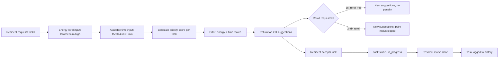

# Agent Briefing: Daily Task Engine

## Round: 4
## Project: Evenly

## Context
Evenly is a self-hosted household management tool. Rounds 1–3 are complete:
infrastructure runs, household is configured, task catalog is populated.
This round implements the core daily suggestion logic — the heart of the product.
A resident provides their energy level and available time. The system scores all eligible tasks
and returns 2–3 personalized suggestions. Residents can accept, skip, or reroll.
All logic is rule-based — no AI at runtime.

## Area
Area C — Daily Task Engine + Scoring Engine

## Workflow Reference


## Tasks

### Data Models
- [ ] `TaskAssignment` — id, resident_id, task_template_id, status (suggested/accepted/in_progress/completed/skipped/delegated), suggested_at, accepted_at, completed_at, reroll_count, points_awarded
- [ ] `DailySession` — id, resident_id, date, energy_level, available_minutes, reroll_count, created_at

### Scoring Engine (`backend/app/agents/suggestion_agent.py`)
Implement priority score calculation per task per resident:

```
score = overdue_factor
      + seasonality_factor
      - rejection_malus
      + imbalance_bonus
      + random_factor
      + unpopular_bonus
      + robot_preference_bonus    (new — energy-aware robot logic)
      - robot_manual_malus        (new — suppresses manual when robot preferred)
```

- [ ] **overdue_factor**: `(days_since_last_done / effective_frequency_days) * 10` — capped at 50
  - `effective_frequency_days = recommended_frequency_days / robot_frequency_multiplier` when device present
  - e.g. vacuum normally every 3 days → with robot: every 3/0.4 = 7.5 days
- [ ] **seasonality_factor**: +5 for garden tasks in spring/summer, +5 for indoor deep-clean in autumn/winter
- [ ] **rejection_malus**: -3 per recent rejection (last 7 days), recovers +1/day
- [ ] **imbalance_bonus**: +8 if this task was always done by other residents (detect from history)
- [ ] **random_factor**: random float between 0.0 and 3.0 (wildcard, ensures variety)
- [ ] **unpopular_bonus**: +5 if task category is "dislike" for ALL active residents

**Robot-aware scoring rules (new):**
- [ ] **robot_preference_bonus**: if `task.is_robot_variant = true` AND corresponding device flag is `true` AND `session.energy_level = low` → +20 bonus
- [ ] **robot_manual_malus**: if `task.is_robot_variant = false` AND it has a robot variant AND device flag is `true` AND `session.energy_level = low` → -10 malus (robot version is preferred)
- [ ] **robot_recent_run suppression**: if robot task was completed within last 24h → suppress its paired manual task entirely (exclude from suggestions)
- [ ] At `energy=medium` or `high`: no robot bonus/malus — both manual and robot tasks compete on normal score
- [ ] At `energy=low`: robot variants get strong boost, manual variants get malus — resident sees "Start robot" instead of "Vacuum floors"

- [ ] Filter tasks: energy_level must match or be below resident's current energy input
- [ ] Filter tasks: duration must fit within available_minutes
- [ ] Filter tasks: device_flag tasks hidden if corresponding household device flag is `false`
- [ ] Filter tasks: household_flag tasks hidden if corresponding household composition flag is `false`
- [ ] Exclude: tasks completed within their effective frequency window (unless overdue)
- [ ] Exclude: delegated tasks pending for this resident (only delegated task shown instead)
- [ ] Sort by score descending, return top 3

### Reroll Logic
- [ ] Track `reroll_count` per `DailySession`
- [ ] First reroll: free, new suggestions drawn (exclude previously shown tasks this session)
- [ ] Second reroll onwards: new suggestions drawn + log `reroll_malus = true` on session (Gamification Agent will deduct points in R6)

### Unpopular Task Escalation
- [ ] If a task is overdue by 2x its recommended frequency AND all residents have it as "dislike":
  - Force-include it as one of the 3 suggestions (cannot be replaced by reroll)
  - Label it clearly as "overdue — someone needs to do this"
- [ ] Rotate forced assignment between residents (never same person twice in a row)

### API Endpoints
- [ ] `POST /sessions` — start a daily session: `{ resident_id, energy_level, available_minutes }`
- [ ] `GET /sessions/{id}/suggestions` — get 2–3 task suggestions for this session
- [ ] `POST /sessions/{id}/reroll` — reroll suggestions
- [ ] `POST /assignments/{id}/accept` — accept a suggested task
- [ ] `POST /assignments/{id}/complete` — mark task as done
- [ ] `POST /assignments/{id}/skip` — skip a task (logged, affects scoring)

## Expected Output
- [ ] `suggestion_agent.py` with full scoring engine implemented
- [ ] `POST /sessions` creates a session and returns suggestions
- [ ] Suggestions respect energy level and time constraints
- [ ] Reroll works: free first time, subsequent rerolls flagged
- [ ] Overdue unpopular tasks are force-included when threshold exceeded
- [ ] `POST /assignments/{id}/complete` saves completion with timestamp

## Boundaries
- NOT: Implement points or streaks (R6 — Gamification)
- NOT: Implement delegation (R6)
- NOT: Build UI (R9)
- NOT: Use AI for scoring — purely rule-based

## Done When
- [ ] `POST /sessions` with energy=medium, time=30 returns 3 relevant task suggestions
- [ ] Rerolling twice on same session flags second reroll correctly
- [ ] Completing an assignment updates `completed_at` in DB
- [ ] A task completed yesterday does not appear in today's suggestions (if within frequency window)
- [ ] A task overdue 2x appears in suggestions even if resident dislikes it

## Technical Specifications
- Backend: Python + FastAPI
- Scoring: pure Python math, no external dependencies
- Energy levels: `low`, `medium`, `high`
- Available time options: 15, 30, 45, 60, 90 minutes
- Seasonality: derive from `datetime.now().month` — spring: 3–5, summer: 6–8, autumn: 9–11, winter: 12–2
- Random factor: `random.uniform(0.0, 3.0)` — re-seeded per session
- All scoring weights configurable as constants at top of file for easy tuning:
  - `ROBOT_LOW_ENERGY_BONUS = 20`
  - `ROBOT_MANUAL_LOW_ENERGY_MALUS = 10`
  - `ROBOT_RECENT_RUN_HOURS = 24` (suppression window)
- Robot frequency reduction: applied via `task.robot_frequency_multiplier` field from catalog
- Household device flags: read from `household` object at session start, passed into scoring context

---

## QA
After this round is complete, run the **QA Agent** (`agents/qa-agent.md`).

**QA report output:** `projects/evenly/qa/qa-report-r4.md`

**Key checks for this round:**
- `POST /sessions` with energy=medium, time=30 returns exactly 3 suggestions
- Suggestions respect energy level filter (no high-energy tasks for low-energy input)
- Suggestions respect time filter (no task longer than available minutes)
- Task completed yesterday does not reappear if within effective frequency window
- Task overdue 2x frequency appears even if disliked
- Second reroll in same session sets reroll malus flag
- Scoring constants defined at top of `suggestion_agent.py` — not scattered
- `energy=low` + robot vacuum present → robot variant scores higher than manual variant
- `energy=medium` + robot vacuum present → both variants compete on equal footing
- Robot task completed within 24h → paired manual vacuum task excluded from suggestions
- Device_flag task hidden when household device flag is false
- Household_flag task hidden when household composition flag is false
