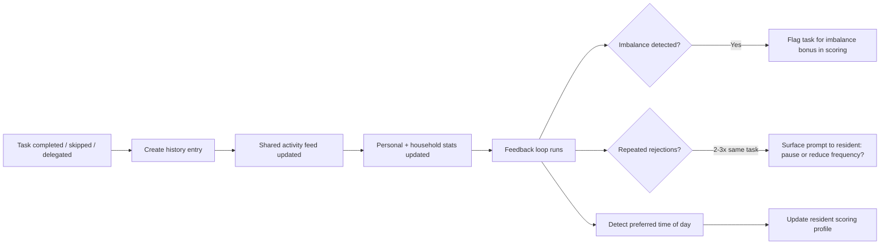

# Agent Briefing: History & Feedback Loop

## Round: 5
## Project: Evenly

## Context
Evenly is a self-hosted household management tool. Rounds 1–4 are complete:
infrastructure, configuration, catalog, and the daily task engine are all working.
This round implements the history layer — logging every action, making it visible to all residents,
and feeding signals back into the scoring engine so it learns from behavior over time.
No AI involved — purely rule-based feedback loop.

## Area
Area E — History, Transparency & Feedback Loop

## Workflow Reference

## Tasks

### Data Models
- [ ] `HistoryEntry` — id, resident_id, task_template_id, assignment_id, action (completed/skipped/delegated/delegation_received), timestamp, room_type, points_awarded, was_unpopular (bool), was_forced (bool)
- [ ] `ResidentScoringProfile` — resident_id, task_template_id, rejection_count, last_rejected_at, preferred_time_of_day (morning/evening/none), imbalance_flag (bool), last_updated
- [ ] `HouseholdFeedEntry` — id, resident_id, text, action_type, timestamp, task_name (denormalized for display speed)

### History Recording
- [ ] On task `completed`: write HistoryEntry + HouseholdFeedEntry ("Alex completed: Wipe kitchen counters")
- [ ] On task `skipped`: write HistoryEntry (no feed entry — skips are private)
- [ ] On task `delegated`: write HistoryEntry for sender + receiver, feed entry ("Alex delegated to Sam: Clean bathroom mirror")
- [ ] On `delegation_received` completed: write HistoryEntry + feed entry

### Feedback Loop (runs after every completion or skip)
- [ ] **Rejection tracking**: increment `rejection_count` on ResidentScoringProfile when task is skipped
  - At 2 rejections of same task: log warning flag
  - At 3 rejections: surface suggestion prompt to resident via API response ("You've skipped this 3 times — want to pause it or reduce frequency?")
  - Rejection count decays: -1 per 14 days without rejection
- [ ] **Imbalance detection**: after each completion, check if this task has been done exclusively by one resident in the last 30 days
  - If yes: set `imbalance_flag = true` on ResidentScoringProfile for all OTHER residents (boost their score for this task)
- [ ] **Time of day preference**: log hour of completion per resident per task category
  - After 5+ completions in same time window: set `preferred_time_of_day` on profile
  - Scoring engine uses this to boost tasks during preferred window

### Stats Aggregation
- [ ] `GET /residents/{id}/stats` — returns:
  - Total tasks completed (all time, this week, this month)
  - Favorite room (most completions)
  - Favorite category
  - Tasks skipped this week
  - Current streak (delegated to Gamification in R6 — leave as placeholder)
- [ ] `GET /household/stats` — returns:
  - Total household completions this week/month
  - Most completed task
  - Most skipped task
  - Resident breakdown (who contributed what %)

### API Endpoints
- [ ] `GET /feed` — return last 50 HouseholdFeedEntries (newest first), optional `?limit=` param
- [ ] `GET /history` — full history log, filterable by `resident_id`, `room_type`, `date_from`, `date_to`
- [ ] `GET /residents/{id}/stats` — personal stats
- [ ] `GET /household/stats` — household-wide stats
- [ ] `GET /residents/{id}/scoring-profile` — internal: current scoring profile (rejection flags, imbalance, time prefs)

## Expected Output
- [ ] Every completed/skipped/delegated task creates a HistoryEntry
- [ ] Feed shows human-readable entries for completed and delegated tasks
- [ ] After 3 skips of same task, API response includes prompt suggestion
- [ ] Imbalance flag correctly set after one-sided task history
- [ ] Stats endpoints return correct aggregated data

## Boundaries
- NOT: Implement points, streaks, or vouchers (R6)
- NOT: Build UI (R9)
- NOT: Use AI for analysis (v2.0 — Insight Agent)
- NOT: Send notifications (no push/email system in v1.0)

## Done When
- [ ] Completing a task via `POST /assignments/{id}/complete` creates HistoryEntry and FeedEntry
- [ ] `GET /feed` returns readable activity entries
- [ ] `GET /residents/{id}/stats` returns correct completion counts
- [ ] Skipping same task 3 times returns a prompt message in API response
- [ ] Imbalance flag appears in scoring profile after skewed history

## Technical Specifications
- Backend: Python + FastAPI
- All history is append-only — no entries are ever deleted or modified
- Feed text is human-readable English, generated server-side from action + task name
- Time of day windows: morning = 05:00–12:00, afternoon = 12:00–18:00, evening = 18:00–23:00
- Stats are computed on-the-fly from history (no separate aggregation table needed in v1.0)
- Feedback loop runs synchronously after each task action (fast enough for household scale)

---

## QA
After this round is complete, run the **QA Agent** (`agents/qa-agent.md`).

**QA report output:** `projects/evenly/qa/qa-report-r5.md`

**Key checks for this round:**
- Completing a task creates both a HistoryEntry and a HouseholdFeedEntry
- Skipping a task creates a HistoryEntry but NO feed entry
- Skipping same task 3 times returns prompt message in API response
- `GET /feed` returns human-readable entries in reverse chronological order
- Imbalance flag set correctly after one-sided task history (30-day window)
- `GET /residents/{id}/stats` returns correct completion counts
- History entries are never modified or deleted after creation
