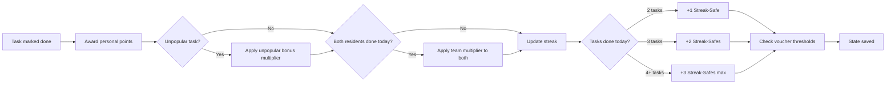

# Agent Briefing: Gamification

## Round: 6
## Project: Evenly

## Context
Evenly is a self-hosted household management tool. Rounds 1–5 are complete:
infrastructure, configuration, catalog, task engine, and history are all working.
This round implements the gamification layer — points, team multipliers, streaks, streak-safes,
delegation costs, unpopular task bonuses, reroll malus, and vouchers.
All logic is white-hat: rewarding positive behavior, never punishing rest.
No AI involved — purely rule-based.

## Area
Area F — Gamification

## Workflow Reference

## Tasks

### Data Models
- [ ] `ResidentGameProfile` — resident_id, total_points, current_streak, longest_streak, streak_safes_available, streak_safes_used, last_activity_date, created_at
- [ ] `HouseholdGameProfile` — household_id, team_points, team_streak, last_team_activity_date
- [ ] `PointTransaction` — id, resident_id, amount, reason (task_completed/team_bonus/unpopular_bonus/delegation_cost/reroll_malus/voucher_redeemed), reference_id, timestamp
- [ ] `Voucher` — id, resident_id, type (free_day/custom), label, earned_at, redeemed_at, is_redeemed (bool)
- [ ] `DelegationRecord` — id, from_resident_id, to_resident_id, assignment_id, delegated_at, deadline_at, completed_at, points_deducted

### Gamification Agent (`backend/app/agents/gamification_agent.py`)

**Point Values (configurable constants):**
- [ ] Base points per task: `10`
- [ ] Unpopular task bonus multiplier: `1.5x` (i.e. 15 points instead of 10)
- [ ] Team multiplier (both residents complete tasks on same day): `1.3x` applied to both
- [ ] Reroll malus (2nd+ reroll in a session): `-3 points`
- [ ] Delegation cost (sender): `-5 points`

**On task completed:**
- [ ] Award base points to resident
- [ ] If task is unpopular (all residents dislike category): apply 1.5x multiplier
- [ ] Check if all active residents have completed at least one task today → apply team multiplier
- [ ] Update `ResidentGameProfile.total_points`
- [ ] Log `PointTransaction`

**Streak logic:**
- [ ] A streak increments if resident completes at least 1 task today AND yesterday (or streak-safe was used)
- [ ] On missed day: check `streak_safes_available`
  - If safe available: decrement safes, streak continues, log usage
  - If no safe: streak resets to 0
- [ ] Streak-safes earned per day based on tasks completed that day:
  - 1 task: +0 safes
  - 2 tasks: +1 safe
  - 3 tasks: +2 safes
  - 4+ tasks: +3 safes (maximum per day, no cap on total safes held)
- [ ] Update `longest_streak` if current exceeds it

**Voucher system:**
- [ ] Voucher thresholds (configurable): every 100 points → earn 1 voucher
- [ ] Voucher types: `free_day` (skip one day without streak penalty), `custom` (household-defined reward)
- [ ] Vouchers are personal — cannot be shared or transferred
- [ ] `free_day` voucher: when redeemed, grants 1 streak-safe immediately

**Delegation:**
- [ ] `POST /assignments/{id}/delegate` — body: `{ to_resident_id }`
  - Validate: task not in receiver's "dislike" category → reject with 400 if so
  - Deduct points from sender
  - Set assignment status to `delegated`
  - Create DelegationRecord with `deadline_at = now + 3 days`
  - New assignment created for receiver with status `delegation_received`
- [ ] Background job (runs daily): check DelegationRecord for expired deadlines
  - If expired: lock receiver's suggestions (only delegated task shown), mark `no_points_on_completion = true`

### API Endpoints
- [ ] `GET /residents/{id}/game-profile` — points, streak, safes, vouchers
- [ ] `GET /residents/{id}/transactions` — point history
- [ ] `GET /household/game-profile` — team points, team streak
- [ ] `POST /assignments/{id}/delegate` — delegate task to another resident
- [ ] `GET /vouchers` — list resident's vouchers (filter by is_redeemed)
- [ ] `POST /vouchers/{id}/redeem` — redeem a voucher

## Expected Output
- [ ] Completing a task awards correct points (base + modifiers)
- [ ] Team multiplier applies when all residents complete tasks same day
- [ ] Streak increments daily, resets correctly when no safe available
- [ ] Streak-safes earned correctly based on task count per day
- [ ] Delegation deducts sender points, creates receiver assignment
- [ ] Expired delegation locks receiver suggestions
- [ ] Voucher earned at 100-point threshold
- [ ] `free_day` voucher grants +1 streak-safe on redemption

## Boundaries
- NOT: Build UI (R9)
- NOT: Gamify Panic Mode differently — Panic Mode tasks earn normal points
- NOT: Implement leaderboards or social comparison (out of scope for v1.0)
- NOT: Auto-redeem vouchers — always resident's explicit choice

## Done When
- [ ] `GET /residents/{id}/game-profile` returns correct streak and points after task completion
- [ ] Second reroll in same session correctly deducts 3 points
- [ ] Delegation rejected with 400 if receiver dislikes task category
- [ ] Expired delegation (3 days) correctly locks receiver task queue
- [ ] Streak-safe auto-applied on missed day when available

## Technical Specifications
- Backend: Python + FastAPI
- All point values as named constants in `gamification_agent.py` — easy to tune
- Daily streak check: triggered by `POST /assignments/{id}/complete` and by daily background job
- Background job: use APScheduler (add to requirements.txt) — runs at 00:01 daily
- Streak-safe storage: integer count in `ResidentGameProfile.streak_safes_available`
- No cap on streak length, no cap on total safes held

---

## QA
After this round is complete, run the **QA Agent** (`agents/qa-agent.md`).

**QA report output:** `projects/evenly/qa/qa-report-r6.md`

**Key checks for this round:**
- Completing a task awards correct base points (10)
- Unpopular task completion awards 15 points (1.5x modifier)
- Team multiplier applies when all residents complete at least 1 task same day
- 2 tasks in one day → +1 streak-safe; 4 tasks → +3 streak-safes (max)
- Missed day with safe available: streak continues, safe decremented
- Missed day without safe: streak resets to 0
- Delegation rejected with 400 if receiver has task category as "dislike"
- Expired delegation (3 days) locks receiver task queue
- All point values defined as named constants — not magic numbers
- APScheduler job registered once at startup

> **Milestone 2 follows this round.**
> After QA passes, run the **Review Agent** (`agents/review-agent.md`) for Milestone 2.
> Review report output: `projects/evenly/qa/review-report-milestone-2.md`
