# Agent Briefing: Panic Mode

## Round: 7
## Project: Evenly

## Context
Evenly is a self-hosted household management tool. Rounds 1–6 are complete.
Panic Mode is a special activation by any resident when unexpected guests are arriving.
It generates a prioritized, time-boxed cleaning plan (2–4 hours) focused on visible and shared areas.
Tasks are distributed across all available residents. All completions feed into history and gamification normally.

## Area
Area D — Panic Mode

## Workflow Reference

```mermaid
flowchart LR
    Trigger[Any resident activates Panic Mode] --> Duration[Select time available: 2h / 3h / 4h]
    Duration --> Available[Select which residents are available]
    Available --> Priority[Score tasks: visible + shared areas first]
    Priority --> Plan[Generate step-by-step plan]
    Plan --> Assign[Distribute tasks across available residents]
    Assign --> Execute[Residents work through plan]
    Execute --> Complete[Mark tasks done individually]
    Complete --> Log[History + Gamification updated normally]
```

## Tasks

### Data Model
- [ ] `PanicSession` — id, activated_by_resident_id, available_minutes, available_resident_ids (JSON array), created_at, completed_at, status (active/completed)

### Panic Agent (`backend/app/agents/panic_agent.py`)

**Prioritization logic (different from daily engine):**
- [ ] Priority tier 1 — shared + visible rooms: living room, hallway, kitchen, bathroom (guest toilet first)
- [ ] Priority tier 2 — less visible but common: dining area, staircase
- [ ] Priority tier 3 — private rooms: bedrooms, children's room (only if time permits)
- [ ] Within each tier: sort by visual impact (surfaces > floors > details)
- [ ] Filter by: active tasks only, not completed within last 24 hours
- [ ] Ignore energy level and preferences — Panic Mode overrides normal filters
- [ ] Fill time slot: sum task durations until `available_minutes` is reached (+10% buffer allowed)
- [ ] Distribute tasks evenly across `available_residents` (round-robin by duration)

**Plan generation:**
- [ ] Return ordered list of assignments per resident
- [ ] Each assignment: task name, room, estimated duration, assigned resident
- [ ] Include brief human-readable instructions per task
- [ ] Add a recommended order note: "Start with hallway and bathroom — most likely seen first"

### API Endpoints
- [ ] `POST /panic` — activate panic mode: `{ available_minutes, available_resident_ids }`
  - Returns: full plan grouped by resident, ordered by priority
- [ ] `GET /panic/{id}` — get current panic session and progress
- [ ] `POST /panic/{id}/complete` — mark entire panic session as done (marks all remaining as complete)
- [ ] Reuse existing `POST /assignments/{id}/complete` for individual task completion within panic session

## Expected Output
- [ ] `POST /panic` with 2 residents and 120 minutes returns a realistic, prioritized plan
- [ ] Plan covers visible rooms first (hallway, bathroom, kitchen, living room)
- [ ] Tasks distributed evenly between residents
- [ ] Individual task completion works via existing assignments endpoint
- [ ] Completions feed into history and gamification (normal points)
- [ ] Panic session stored in DB with status tracking

## Boundaries
- NOT: Override gamification — panic tasks earn normal points
- NOT: Require all residents to participate — available_resident_ids can be just one person
- NOT: Use AI for plan generation — purely rule-based prioritization
- NOT: Block daily task engine during active panic session — they can run in parallel

## Done When
- [ ] `POST /panic` returns a valid plan within the requested time budget
- [ ] Visible areas always appear before private rooms in the plan
- [ ] Tasks are distributed across selected residents (not all assigned to one)
- [ ] Completing all panic tasks updates history for all involved residents

## Technical Specifications
- Backend: Python + FastAPI
- Prioritization: static room tier list as constant in `panic_agent.py`
- Visual impact ranking within tier: surfaces (wipe/clean) > vacuum/mop floors > detail tasks
- Time buffer: allow plan to exceed requested time by max 10% to avoid awkward gaps
- Panic session duration options: 120, 180, 240 minutes (2h, 3h, 4h)
- Task instructions: generated as simple template strings (e.g. "Wipe all surfaces in {room}" — no AI)

---

## QA
After this round is complete, run the **QA Agent** (`agents/qa-agent.md`).

**QA report output:** `projects/evenly/qa/qa-report-r7.md`

**Key checks for this round:**
- `POST /panic` with 2 residents and 120 minutes returns a valid plan within time budget (max 132 min)
- Visible rooms (hallway, bathroom, kitchen, living room) appear before bedrooms in the plan
- Tasks distributed across both selected residents — not all assigned to one
- Completing a panic task via existing `/assignments/{id}/complete` updates history normally
- Panic tasks award normal points via gamification agent
- Room tier list defined as constant in `panic_agent.py` — not hardcoded in logic
