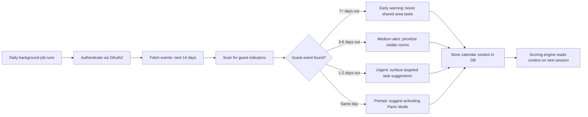

# Agent Briefing: Calendar Integration

## Round: 8
## Project: Evenly

## Context
Evenly is a self-hosted household management tool. Rounds 1–7 are complete.
This round connects Evenly to the household's shared Google Calendars.
The Calendar Agent runs daily in the background, scans for upcoming events that signal guest visits,
and adjusts the daily task suggestion scoring accordingly — from gentle early warnings to Panic Mode prompts.

## Area
Area G — Calendar Integration

## Workflow Reference

## Tasks

### Data Model
- [ ] `CalendarEvent` — id, google_event_id, title, start_datetime, end_datetime, guest_probability (low/medium/high), alert_level (early/medium/urgent/panic), processed_at
- [ ] `CalendarConfig` — household_id, google_refresh_token, calendar_ids (JSON array of calendar IDs to monitor), last_synced_at, is_active

### OAuth2 Setup
- [ ] `GET /calendar/auth` — redirect to Google OAuth2 consent screen
- [ ] `GET /calendar/callback` — handle OAuth2 callback, store refresh token in CalendarConfig
- [ ] Use Google Calendar API scopes: `calendar.readonly`
- [ ] Store refresh token securely in DB (not in .env — it's per-household)
- [ ] Token refresh: handle automatically via Google API client library

### Calendar Agent (`backend/app/agents/calendar_agent.py`)

**Guest detection heuristics (keyword-based, no AI):**
- [ ] High probability keywords (in event title/description): "Besuch", "visit", "guests", "birthday", "party", "dinner", "Geburtstag", "Feier", "kommt vorbei", "coming over"
- [ ] Medium probability: any event with multiple attendees not in resident list
- [ ] Low probability: all other non-household events (ignored)

**Alert level assignment:**
- [ ] `days_until_event >= 7`: alert_level = `early`
- [ ] `3 <= days_until_event <= 6`: alert_level = `medium`
- [ ] `1 <= days_until_event <= 2`: alert_level = `urgent`
- [ ] `days_until_event == 0`: alert_level = `panic`

**Scoring context injection:**
- [ ] Store active alert level in a `HouseholdContext` table (current_alert_level, event_date, event_title)
- [ ] Suggestion Agent reads `HouseholdContext` and applies scoring boosts:
  - `early`: +5 to all shared/visible room tasks
  - `medium`: +10 to tier-1 rooms (kitchen, bathroom, living room, hallway)
  - `urgent`: +20 to tier-1 rooms, force-include at least 1 visible-area task in suggestions
  - `panic`: surface prompt to resident: "Guests arriving today — want to activate Panic Mode?"

**Background job:**
- [ ] Schedule daily sync at 07:00 via APScheduler
- [ ] Fetch events for next 14 days
- [ ] Re-evaluate alert levels daily (event gets closer each day)
- [ ] Clear expired events (past events) automatically

### API Endpoints
- [ ] `GET /calendar/auth` — start OAuth2 flow
- [ ] `GET /calendar/callback` — complete OAuth2 flow
- [ ] `GET /calendar/status` — returns sync status, last synced, active alert level
- [ ] `POST /calendar/sync` — manual trigger for immediate sync
- [ ] `GET /calendar/events` — list detected guest events (next 14 days)
- [ ] `PUT /calendar/config` — update which calendar IDs to monitor

## Expected Output
- [ ] OAuth2 flow completes and stores refresh token
- [ ] Daily sync detects events with guest keywords
- [ ] Correct alert level assigned based on days until event
- [ ] HouseholdContext updated after each sync
- [ ] Suggestion Agent scores boosted correctly based on active alert
- [ ] Panic prompt surfaces in session response when alert_level = panic

## Boundaries
- NOT: Read event content beyond title and description (privacy)
- NOT: Create, modify, or delete calendar events
- NOT: Send any notifications or emails (no push system in v1.0)
- NOT: Use AI to interpret event content — keyword matching only
- NOT: Monitor more than 14 days ahead (too speculative to be useful)

## Done When
- [ ] OAuth2 setup completes via `/calendar/auth` → `/calendar/callback`
- [ ] `POST /calendar/sync` returns list of detected events with alert levels
- [ ] An event 5 days away with "Besuch" in title gets alert_level = `medium`
- [ ] Daily task suggestions score shared-area tasks higher when alert is active
- [ ] `GET /calendar/status` shows last sync time and current alert level

## Technical Specifications
- Backend: Python + FastAPI
- Google API: `google-api-python-client`, `google-auth-oauthlib` (add to requirements.txt)
- OAuth2 scopes: `https://www.googleapis.com/auth/calendar.readonly`
- Client credentials: loaded from `.env` as `GOOGLE_CLIENT_ID`, `GOOGLE_CLIENT_SECRET`
- Refresh token: stored in `CalendarConfig` table (per household)
- Scheduler: APScheduler (already added in R6), add calendar sync job at 07:00
- Keyword list: defined as constant in `calendar_agent.py` — easy to extend
- HouseholdContext table: single-row table, upserted on each sync

---

## QA
After this round is complete, run the **QA Agent** (`agents/qa-agent.md`).

**QA report output:** `projects/evenly/qa/qa-report-r8.md`

**Key checks for this round:**
- OAuth2 flow completes via `/calendar/auth` → `/calendar/callback` and stores refresh token
- `POST /calendar/sync` detects events with guest keywords and assigns correct alert levels
- Event 5 days away with "Besuch" in title → alert_level = `medium`
- Event same day → panic prompt surfaces in session suggestion response
- Daily sync job registered at 07:00 via APScheduler — not duplicated
- Google client credentials loaded from `.env` — never hardcoded
- Keyword list defined as constant in `calendar_agent.py`
- Calendar events never created, modified, or deleted — read-only
