# Agent Briefing: Web App UI

## Round: 9
## Project: Evenly

## Context
Evenly is a self-hosted household management tool. Rounds 1–8 are complete — the full backend is working.
This round builds the frontend: a mobile-first Vue.js + Vuetify web app that connects to the FastAPI backend.
The primary use case is a resident opening the app on their phone, quickly entering their energy level and time,
and acting on 2–3 task suggestions. Everything should feel fast, clear, and low-friction.
The designer (project owner) is a UX professional — prioritize clean, focused UI over feature density.

## Area
Area I — Interface (Web App)

## Workflow Reference

```mermaid
flowchart LR
    Open[Resident opens app] --> Home[Home screen]
    Home --> Session[Start daily session]
    Session --> Energy[Pick energy level]
    Energy --> Time[Pick available time]
    Time --> Suggestions[View 2-3 task cards]
    Suggestions --> Action[Accept / Skip / Reroll / Delegate]
    Action --> Done[Mark task complete]
    Done --> Points[See points + streak update]
    Points --> Feed[Optionally check activity feed]
```

## Screens & Components

### 0. First-Run Setup Wizard (Admin)
Shown when no households exist in the DB. Replaces the normal app until complete.

**Step 1 — Welcome**
- App name + brief tagline
- Single CTA: "Set up your household"

**Step 2 — Your household**
- Household name (text input)
- Language / timezone (optional dropdown, defaults to system)

**Step 3 — Who lives here?**
- Children in household? (toggle) → if yes: select age groups (multi-select chips: Baby 0–2 / Toddler 2–6 / School-age 6+)
- Cats? (toggle)
- Dogs? (toggle)
- Garden? (toggle)

**Step 4 — Appliances & devices**
Each shown as a labeled toggle (boolean — yes/no):
- Robot vacuum
- Robot mop
- Dishwasher
- Washing machine
- Dryer
- Window cleaner (handheld device)
- Steam cleaner
- Robot lawn mower *(only shown if garden = yes)*
- Irrigation system *(only shown if garden = yes)*

**Step 5 — Rooms**
- Pre-filled list based on common rooms: activate/deactivate via toggle chips
- "Add custom room" option
- Common rooms: Kitchen, Living Room, Bathroom, Bedroom, Hallway, Children's Room, Garden *(only if garden=yes)*

**Step 6 — Your profile (first Admin)**
- Name (text input)
- Display name (text input)
- Avatar color (color picker — preset palette of 8 colors)
- Set your PIN (4-digit numeric pad, confirm once)
- Cleaning preferences: like / neutral / dislike per category (swipeable cards or segmented control per row)

**Step 7 — Add co-residents** *(optional, can skip)*
- For each co-resident:
  - Name + display name
  - Avatar color
  - Role (edit / view)
  - Initial PIN (4-digit, they can change on first login)
- "+ Add another" button
- Skip option: "Add residents later in settings"

**Step 8 — Ready**
- Summary: household name, # residents, rooms, active appliances
- CTA: "Generate task catalog" → triggers `POST /catalog/generate`
- After generation: "Review your task catalog" → opens catalog browser
- Final CTA: "Start using Evenly"

---

### First-Login Wizard (Co-residents)
Shown to any resident who has never completed setup (tracked via `setup_complete` flag on Resident).

**Step 1 — Welcome [display_name]**
- Brief intro: "Let's personalize Evenly for you"

**Step 2 — Change your PIN** *(optional)*
- "Keep initial PIN" or enter new 4-digit PIN

**Step 3 — Cleaning preferences**
- Same preference flow as admin wizard (like / neutral / dislike per category)

**Step 4 — Done**
- "You're all set!" → go to Home screen
- Preferences can be changed anytime in My Profile

---

### 1. Home Screen
- Current streak + streak-safes (prominent, top area)
- Today's points earned
- Quick action: "Get tasks" button (primary CTA)
- Household feed preview (last 3 entries)
- Alert banner if calendar warning is active (e.g. "Guests in 2 days — shared areas prioritized")
- Panic Mode button (secondary, clearly labeled, not alarming visually)

### 2. Session Start
- Step 1: Energy level picker — 3 large touch-friendly cards: Low / Medium / High (icon + label)
- Step 2: Time picker — horizontal scroll or segmented control: 15 / 30 / 45 / 60 / 90 min
- No text input — all tap-based

### 3. Task Suggestions Screen
- 2–3 task cards, each showing:
  - Task name (large, readable)
  - Room (small label + icon)
  - Estimated duration (e.g. "~15 min")
  - Energy level indicator (low/medium/high dot)
  - Overdue badge if applicable
  - "Disliked by all" badge if unpopular task
- Actions per card: Accept (primary) / Skip (ghost button)
- "Reroll" button below cards (labeled clearly — "Show me different tasks")
- Second reroll shows small note: "–3 points for rerolling again"

### 4. Active Task Screen
- Task name + room (large)
- Timer (optional, start/stop — cosmetic only, not tracked)
- "Mark as done" button (large, primary)
- "Delegate to [Resident Name]" option (only shown if another resident exists and task is not in their dislike list)
- Brief tip or instruction if available (from task description)

### 5. Completion Screen
- Points awarded (animated number)
- Streak status ("Day 12 streak!" or "Streak safe used")
- Streak-safes earned today (if any)
- Voucher earned notification (if threshold crossed)
- CTA: "Get another task" or "Done for today"

### 6. Activity Feed Screen
- Chronological list of household actions
- Each entry: resident name + avatar color, action text, timestamp (relative: "2 hours ago")
- Filter: All / Mine

### 7. My Profile Screen
- Personal stats: total points, current streak, longest streak, safes available
- Point history (last 10 transactions)
- Vouchers (earned / redeemed)
- Task preference settings (like / neutral / dislike per category)

### 8. Household Settings Screen
- **Role-gated — PIN required on entry**
- Manage residents (add / edit name + color) — **admin only**
- Manage roles (assign admin/edit/view per resident) — **admin only**
- Manage rooms (add / edit / deactivate) — **admin only**
- Manage devices — **admin only**
- Task catalog browser (activate / deactivate / edit tasks) — **edit + admin**
- Calendar integration status + setup link — **admin only**
- "Regenerate Catalog" button (with confirmation dialog) — **admin only**

### 9. Panic Mode Screen
- Activated from Home or via dedicated button
- Step 1: Select available time (2h / 3h / 4h)
- Step 2: Select which residents are available (checkboxes)
- Step 3: View plan — grouped by resident, ordered by priority room
- Each task: name, room, duration — tap to mark done
- Progress bar: X of Y tasks completed

## Tasks

### Project Setup
- [ ] Scaffold Vue.js 3 project with Vuetify 3 (Material Design 3) inside `frontend/` folder
- [ ] Add to `docker-compose.yml`: frontend service (Vite dev server or nginx for built assets, port 3000)
- [ ] Configure API base URL via environment variable (`VITE_API_URL=http://localhost:8000`)
- [ ] Add Vue Router for navigation between screens
- [ ] Add Pinia for state management (residents, game profile, session, theme preference)
- [ ] Configure Vuetify theme:
  - Light + Dark theme both defined (MD3 color system)
  - Theme toggle stored in localStorage, respects `prefers-color-scheme` on first visit
  - Primary color: calm, neutral tone (not saturated) — minimalist feel
  - Secondary/accent: used only for gamification elements (streaks, points)
  - Use MD3 `v-card`, `v-bottom-navigation`, `v-sheet`, `v-chip` components throughout

### Implementation
- [ ] Implement all 9 screens above
- [ ] Connect all screens to FastAPI endpoints (use axios)
- [ ] Mobile-first layout: max-width 480px centered on desktop, full-width on mobile
- [ ] Bottom navigation bar: Home / Tasks / Feed / Profile (MD3 `v-bottom-navigation`)
- [ ] Resident switcher: top-right avatar tap → switch active resident (no login required in v1.0)
- [ ] Smooth transitions between screens (Vue Router transitions — slide or fade)
- [ ] Empty states for all lists (friendly message + simple SVG placeholder illustration)
- [ ] Error states: API unreachable → clear message ("Can't reach Evenly server")
- [ ] Loading states: MD3 skeleton loaders (`v-skeleton-loader`) while fetching

### Light / Dark Mode
- [ ] Theme toggle button in app bar (sun/moon icon)
- [ ] On first visit: detect `prefers-color-scheme` system preference
- [ ] Selected theme persisted in localStorage (`evenly-theme`)
- [ ] Both themes use the same MD3 color tokens — no hard-coded hex colors in components
- [ ] Test all 9 screens in both light and dark mode before done

### Responsiveness
- [ ] All screens fully usable at 375px (iPhone SE) and 390px (iPhone 14)
- [ ] Desktop view: content centered, max-width 480px, side margins neutral
- [ ] No horizontal scroll on any screen at any breakpoint
- [ ] Touch targets: minimum 48px × 48px on all interactive elements (MD3 standard)
- [ ] Bottom navigation visible and reachable with thumb on all mobile sizes

### Accessibility (bare minimum)
- [ ] All interactive elements have visible focus rings (keyboard navigation)
- [ ] All images and icons have `aria-label` or `alt` text
- [ ] Color is never the only means of conveying information (always paired with text or icon)
- [ ] Form inputs have associated `<label>` elements
- [ ] Page titles update on route change (`document.title`)
- [ ] PIN pad: each button has `aria-label` ("Enter digit X")

### Role & PIN UI (context from R2b)
- [ ] **PIN entry bottom sheet**: appears when a resident attempts an admin/edit action
  - 4-digit PIN pad (large touch targets)
  - On success: action proceeds, PIN session stored in memory for 30 minutes
  - On failure (3 attempts): lock for 5 minutes, show friendly message
- [ ] **Resident switcher**: shows all residents with name + avatar color — no PIN needed to switch
- [ ] **Role-aware UI guards**: hide or disable admin/edit controls for view-role residents
  - Settings screen: edit controls hidden (not just disabled) for view residents
  - Catalog: edit/deactivate buttons hidden for view residents
  - "Add Resident" button: hidden for non-admin residents
- [ ] **Role badge**: small label in resident switcher showing current resident's role
- [ ] **First-run setup**: if no residents exist, show setup wizard — create first resident (auto-assigned admin), set PIN
- [ ] PIN change: accessible in My Profile screen (requires current PIN)

### UX Principles to Follow
- Every primary action reachable in ≤ 2 taps from home screen
- No modals for destructive actions — use inline confirmation (MD3 `v-snackbar` or inline text)
- Task cards: minimum 48px tap target height (MD3 standard), prefer 64px+
- Font size: minimum 16px for body text, 20px+ for primary labels (MD3 typescale)
- Color: use color to reinforce meaning (green = done, amber = pending, red = overdue) — never as sole indicator
- Avoid information overload: home screen shows only what matters right now
- Use MD3 components as-is — do not override component internals, only theme tokens
- Minimalist: no decorative illustrations beyond empty states, no gradients, no shadows beyond MD3 elevation system

## Expected Output
- [ ] Vue.js + Vuetify app running on port 3000 via Docker Compose
- [ ] All 9 screens implemented and navigable
- [ ] Daily session flow works end-to-end (energy → time → suggestions → complete → points)
- [ ] Panic Mode flow works end-to-end
- [ ] Activity feed displays correctly
- [ ] Resident switcher works without login
- [ ] App usable on mobile browser (375px width minimum, no horizontal scroll)
- [ ] Light and dark mode both functional, theme persisted in localStorage
- [ ] System `prefers-color-scheme` respected on first visit
- [ ] All interactive elements meet 48px minimum touch target
- [ ] All icons have aria-labels, all inputs have labels
- [ ] PIN entry bottom sheet appears when view-role resident attempts edit action
- [ ] Admin controls hidden (not just disabled) for view-role residents
- [ ] First-run setup wizard appears when DB has no residents

## Boundaries
- NOT: Implement full login / JWT authentication — PIN per action is sufficient for v1.0
- NOT: Build native mobile app — web app only
- NOT: Implement WhatsApp bot (v1.5, separate round)
- NOT: Add animations beyond simple Vue Router transitions — keep it fast and lightweight
- NOT: Override MD3 component internals — use theme tokens only
- NOT: Re-implement role logic in the frontend — always derive permissions from backend response
- NOT: Achieve WCAG AA full compliance — bare minimum a11y only (labels, focus, color contrast in MD3 defaults)

## Done When
- [ ] `docker compose up` starts frontend on port 3000
- [ ] Full daily task flow completable on a 375px mobile browser
- [ ] Panic Mode generates and displays a plan
- [ ] Points and streak visible after task completion
- [ ] Household settings allow adding a room and activating/deactivating a task
- [ ] View-role resident cannot access admin settings without correct PIN
- [ ] First-run setup wizard creates first admin resident with PIN
- [ ] Light/dark toggle works and persists across page reloads
- [ ] No horizontal scroll at 375px on any screen
- [ ] All task cards tappable with minimum 48px height

## Technical Specifications
- Framework: Vue.js 3 (Composition API) + Vuetify 3 (Material Design 3)
- State management: Pinia (stores: `useResidentStore`, `useThemeStore`, `useSessionStore`, `useGameStore`)
- Routing: Vue Router 4
- HTTP client: axios (add to frontend package.json)
- Build tool: Vite
- Deployment: nginx serving built assets in Docker (production), Vite dev server (development)
- Port: 3000
- API communication: all calls to `VITE_API_URL` — no hardcoded localhost
- Resident identification: stored in localStorage as `activeResidentId` — no auth tokens
- Theme: stored in localStorage as `evenly-theme` (`light` / `dark`) — Vuetify `useTheme().global.name`
- System theme detection: `window.matchMedia('(prefers-color-scheme: dark)')` on first visit only
- PIN session: stored in memory (Pinia store) only — cleared on page reload or after 30 min inactivity
- Role/permission checks: always validated server-side (R2b) — frontend hides UI, backend enforces rules
- PIN input: numeric keypad component, no browser autocomplete
- MD3 color tokens: defined in Vuetify theme config — no raw hex values in components
- Breakpoints: use Vuetify's built-in (`xs`, `sm`, `md`) — no custom media queries unless unavoidable

---

## QA
After this round is complete, run the **QA Agent** (`agents/qa-agent.md`).

**QA report output:** `projects/evenly/qa/qa-report-r9.md`

**Key checks for this round:**
- `docker compose up` starts frontend on port 3000 without errors
- Full daily task flow completable on 375px mobile browser (energy → time → suggestions → complete → points)
- Panic Mode flow works end-to-end
- Light/dark toggle works and persists in localStorage
- System `prefers-color-scheme` detected on first visit
- No horizontal scroll at 375px on any screen
- All task cards have minimum 48px touch target height
- All icons have `aria-label`, all inputs have `<label>`
- View-role resident cannot access admin settings without correct PIN
- PIN entry bottom sheet appears and blocks action on role violation
- Admin controls hidden (not just disabled) for view-role residents
- First-run setup wizard appears when DB has no residents
- No `pin_hash` or sensitive fields visible in browser network responses
- All API calls use `VITE_API_URL` — no hardcoded localhost URLs

> **Milestone 3 follows this round.**
> After QA passes, run the **Review Agent** (`agents/review-agent.md`) for Milestone 3.
> Review report output: `projects/evenly/qa/review-report-milestone-3.md`
