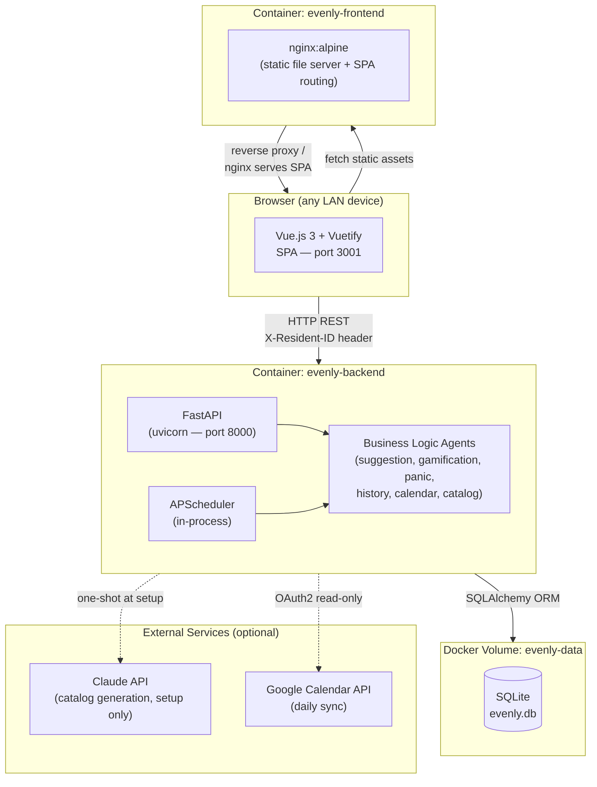
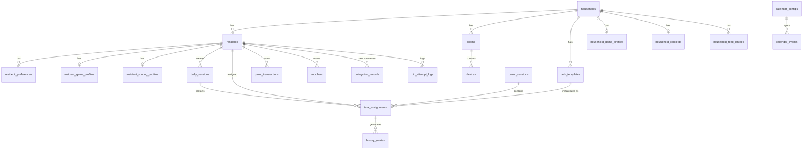
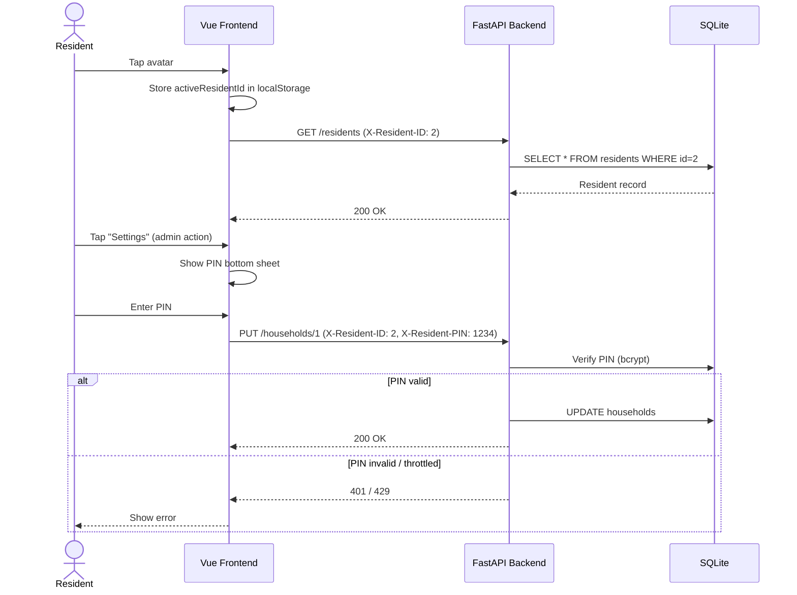
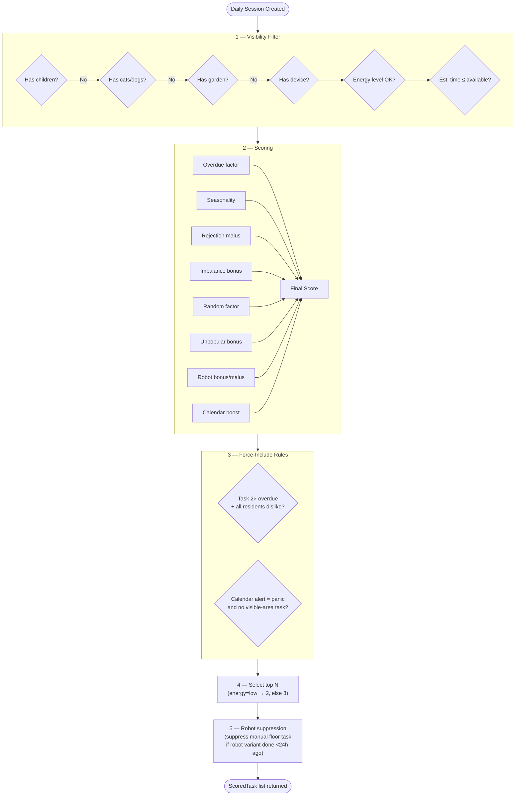
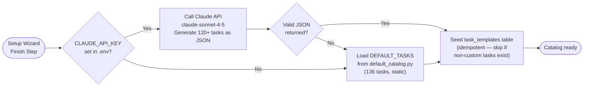
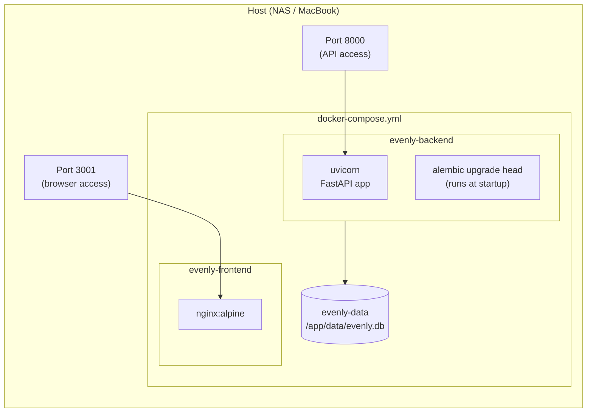
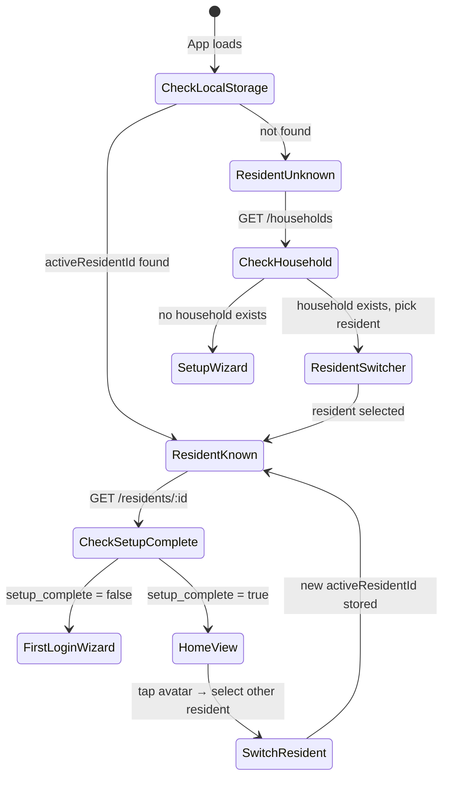
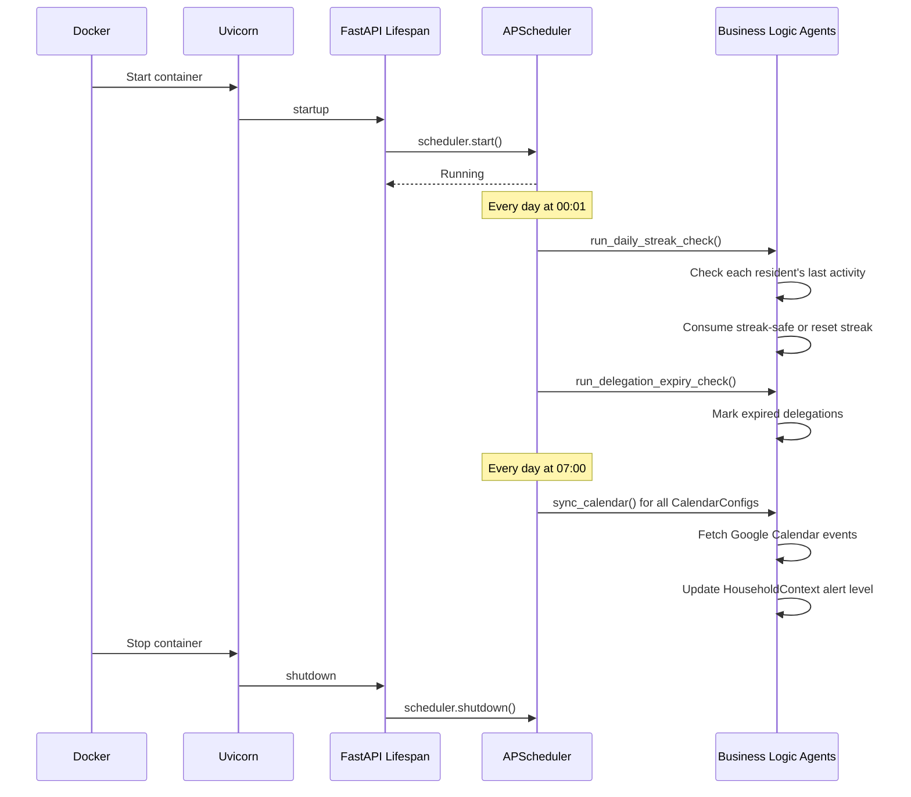
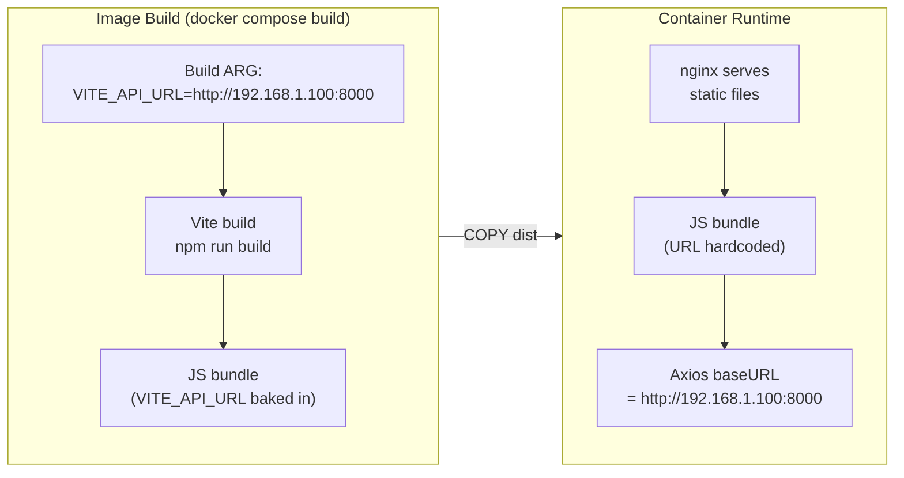
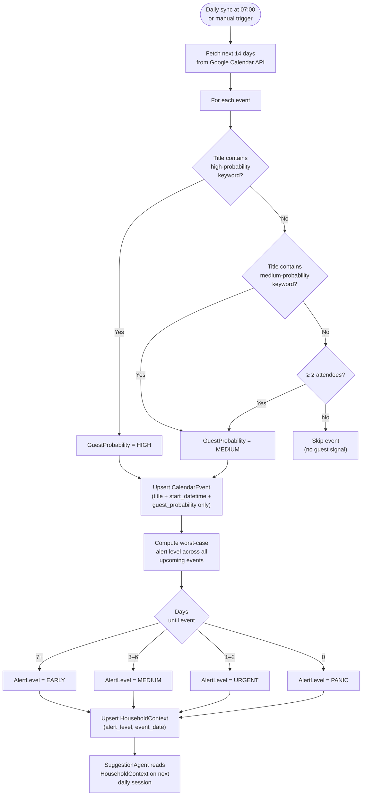

# Architecture Decision Record — Evenly

This document records the key architectural decisions made during the development of Evenly,
including context, rationale, and trade-offs for each choice.

---

## Table of Contents

1. [System Overview](#1-system-overview)
2. [ADR-001 — SQLite as the Database](#adr-001--sqlite-as-the-database)
3. [ADR-002 — Stateless Header-Based Authentication](#adr-002--stateless-header-based-authentication)
4. [ADR-003 — Deterministic Rule-Based Task Scoring](#adr-003--deterministic-rule-based-task-scoring)
5. [ADR-004 — One-Shot AI for Catalog Generation](#adr-004--one-shot-ai-for-catalog-generation)
6. [ADR-005 — Two-Container Docker Compose Deployment](#adr-005--two-container-docker-compose-deployment)
7. [ADR-006 — Pinia + localStorage for Resident State](#adr-006--pinia--localstorage-for-resident-state)
8. [ADR-007 — In-Process Scheduling with APScheduler](#adr-007--in-process-scheduling-with-apscheduler)
9. [ADR-008 — Vite Build-Time API URL Injection](#adr-008--vite-build-time-api-url-injection)
10. [ADR-009 — Read-Only Google Calendar with Keyword Matching](#adr-009--read-only-google-calendar-with-keyword-matching)

---

## 1. System Overview

Evenly is a self-hosted household management tool designed to run on a NAS or local machine.
It replaces reactive weekend cleaning marathons with small daily tasks, distributed fairly
across all residents.



---

## ADR-001 — SQLite as the Database

**Status:** Accepted

**Context:**
Evenly targets self-hosted deployment on consumer NAS devices (e.g. UGreen DXP2800) and
MacBooks via Podman Desktop. The expected household size is 1–8 residents. Write concurrency
is minimal — one daily session per resident, no concurrent writes from multiple processes.

**Decision:**
Use SQLite via SQLAlchemy with Alembic for schema migrations. The database file is stored
in a named Docker volume at `/app/data/evenly.db`.

**Rationale:**
- Zero external dependencies — no separate database container to manage
- Single file backup — copy one file to back up all data
- Alembic handles incremental schema evolution across all 12 migration rounds
- SQLAlchemy ORM provides the same API surface as PostgreSQL; migration path exists if needed

**Trade-offs:**
- No concurrent write support (acceptable for household-scale use)
- SQLite does not support `ALTER COLUMN` — table recreation pattern required (see migration `0008`)
- Not suitable for multi-household SaaS without a database swap



---

## ADR-002 — Stateless Header-Based Authentication

**Status:** Accepted

**Context:**
Evenly runs on a single shared device in the home (a tablet or wall-mounted screen). Multiple
residents use the same browser. Traditional session/JWT authentication assumes one user per
browser — this does not match the usage model.

**Decision:**
Identify the active resident via the `X-Resident-ID` HTTP header. Sensitive actions additionally
require a 4-digit PIN passed in `X-Resident-PIN`. No login sessions, no JWT tokens.

**Rationale:**
- Matches the shared-device model: switching residents is instant (tap avatar → enter PIN)
- Stateless backend — no session store required
- PIN is per-action (admin operations, PIN changes), not per-session — low friction for daily use
- LAN-only deployment removes most remote-attack surface

**Trade-offs:**
- Any browser on the LAN can send arbitrary `X-Resident-ID` headers — not suitable for internet exposure
- PIN brute-force is mitigated via `PINAttemptLog` (3 failures / 10 min → 429 with `Retry-After`)



---

## ADR-003 — Deterministic Rule-Based Task Scoring

**Status:** Accepted

**Context:**
The core value of Evenly is suggesting the *right* 2–3 tasks for each resident every day.
The suggestion algorithm needs to be predictable, tunable, and work fully offline without
any AI dependency at runtime.

**Decision:**
Implement a deterministic scoring engine (`suggestion_agent.py`) that ranks all eligible
tasks for a resident using a weighted formula. No machine learning or AI inference at runtime.

**Scoring formula:**
```
score = overdue_factor        (days since last done × weight, capped at 50)
      + seasonality_factor    (garden tasks in spring/summer; deep cleaning in autumn/winter)
      - rejection_malus       (decays 1 pt/day over 7 days after resident skips)
      + imbalance_bonus       (task done by others but not this resident recently)
      + random_factor         (0–3, for variety across repeated runs)
      + unpopular_bonus       (all residents dislike this category)
      + robot_bonus_or_malus  (energy-aware: robot variants preferred at energy=low)
      + calendar_boost        (+5/+10/+20 for visible-area tasks based on alert level)
```

**Rationale:**
- Fully offline — no API key required for daily operation
- Deterministic behavior is debuggable and explainable to residents
- Scoring weights can be tuned without retraining a model
- Imbalance detection and rejection decay create a natural fairness feedback loop



---

## ADR-004 — One-Shot AI for Catalog Generation

**Status:** Accepted

**Context:**
A task catalog of 100+ household tasks needs to be seeded once at setup. Maintaining a large
hand-curated static catalog is an option, but AI generation produces richer, more
household-specific content (localized names, descriptions, time estimates per room).

**Decision:**
Call the Claude API (`claude-sonnet-4-5`) exactly once during initial setup to generate the
task catalog. If no API key is present, fall back to a bundled static catalog of 136 tasks
defined in `default_catalog.py`. AI is never called again at runtime.

**Rationale:**
- AI is used where it adds value (content generation, natural language task descriptions)
- Zero runtime AI dependency — the app works fully offline after setup
- Static fallback ensures the app is immediately usable without an API key
- One-shot generation is idempotent — re-running does not duplicate tasks



---

## ADR-005 — Two-Container Docker Compose Deployment

**Status:** Accepted

**Context:**
The target deployment environments are a UGreen NAS DXP2800 running UGOS (Docker-compatible)
and a MacBook running Podman Desktop. The deployment must be simple enough for non-technical
users to operate via a GUI.

**Decision:**
Package Evenly as two containers managed by a single `docker-compose.yml`:
1. `evenly-backend` — Python/FastAPI served by uvicorn on port 8000
2. `evenly-frontend` — Vue.js SPA served by nginx on port 3001

One named Docker volume (`evenly-data`) persists the SQLite database across restarts.

**Rationale:**
- Separation of concerns — frontend and backend can be rebuilt independently
- `docker compose up -d` is the entire deployment command
- Podman Desktop can manage the stack via its Compose extension
- Port 3000 conflicts with other local services (e.g. open-webui) — port 3001 used for frontend



---

## ADR-006 — Pinia + localStorage for Resident State

**Status:** Accepted

**Context:**
Multiple residents share a single browser on a shared household device (tablet or wall screen).
There is no concept of a "logged in" user — any resident can be the active resident at any time.
The app must survive page reloads without losing track of who is currently active.

**Decision:**
Store the active resident's ID in `localStorage` via a Pinia store (`resident.js`). All API
calls inject `X-Resident-ID` from this store via an Axios request interceptor.

**Rationale:**
- Survives page reloads without requiring a re-login
- Simple to implement without a full auth system
- Consistent with the header-based auth strategy (ADR-002)
- Pinia stores are reactive — any component that reads `activeResidentId` updates automatically

**Trade-offs:**
- If a resident clears `localStorage`, they see the last active resident on next load
- No isolation between browser tabs on the same device (acceptable — shared device model)



---

## ADR-007 — In-Process Scheduling with APScheduler

**Status:** Accepted

**Context:**
Two recurring background jobs are required:
- **00:01 daily** — streak check (consume streak-safe or reset streak for missed days) + delegation expiry
- **07:00 daily** — Google Calendar sync

**Decision:**
Run both jobs inside the FastAPI process using APScheduler (`BackgroundScheduler`). The scheduler
starts on app startup via the FastAPI lifespan context manager and stops on shutdown.

**Rationale:**
- No external infrastructure required (no Celery, no Redis, no cron on the host)
- Deployment remains a single `docker compose up -d` with no additional services
- Two low-frequency jobs (daily) do not justify the complexity of a task queue
- APScheduler is in-process — if the container restarts, the scheduler restarts automatically

**Trade-offs:**
- Jobs are lost if the container is down at trigger time (acceptable — missed streak checks
  are tolerated; calendar sync will run the next day or can be triggered manually)
- Not suitable for high-frequency or distributed job execution



---

## ADR-008 — Vite Build-Time API URL Injection

**Status:** Accepted

**Context:**
The frontend needs to know the backend URL at runtime. In a self-hosted LAN deployment, this
URL is the NAS IP address (e.g. `http://192.168.1.100:8000`), which differs per household.
Vite replaces `import.meta.env.VITE_*` variables at compile time — they cannot be changed
at runtime without rebuilding the image.

**Decision:**
Pass `VITE_API_URL` as a Docker build argument (`ARG`). Vite bakes it into the JS bundle
during `npm run build`. The default value is `http://localhost:8000` for local development.

**Rationale:**
- Simple — no runtime config injection mechanism required
- Works with nginx serving pure static files (no server-side rendering)
- Consistent with standard Vite deployment practices

**Trade-offs:**
- Changing the backend URL requires rebuilding the frontend image
- The NAS deployment guide must instruct users to set `VITE_API_URL` before building



---

## ADR-009 — Read-Only Google Calendar with Keyword Matching

**Status:** Accepted

**Context:**
Evenly needs to detect upcoming guest visits to trigger Panic Mode suggestions proactively.
The most reliable signal is the household's Google Calendar. Privacy is a concern — residents
may not want calendar content stored or processed in detail.

**Decision:**
Integrate Google Calendar via read-only OAuth2. Store only the event title, start time, and
the computed guest probability. Never store event descriptions, attendee details, or location.
Guest probability is determined by keyword matching on the title (no AI).

**Keyword classification:**
- **High probability:** besuch, visit, birthday, party, geburtstag, hochzeit, wedding, feier, celebration
- **Medium probability:** treffen, meeting, brunch, dinner, lunch, grill, kommen
- **Medium probability upgrade:** ≥2 attendees on a calendar event

**Alert levels by days until event:**
| Days until event | Alert level | Effect on scoring |
|---|---|---|
| 7+ | early | +5 pts to visible-area tasks |
| 3–6 | medium | +10 pts to visible-area tasks |
| 1–2 | urgent | +20 pts to visible-area tasks |
| 0 | panic | Force ≥1 visible-area task; show Panic Mode prompt |

**Rationale:**
- Keyword matching is deterministic, explainable, and privacy-preserving
- No AI inference on calendar content — no data leaves the system during daily operation
- Graceful degradation — if no calendar is configured, scoring runs without calendar boost


