# Project: Evenly

## Vision
A smart household management tool that replaces reactive, conflict-prone cleaning sessions with short daily routines — personalized per resident, context-aware, and intrinsically motivating.

## Status: Phase 4

---

## Phase 1 — Understanding

### Problem
Household chores in a shared home run unorganized and reactively (only when guests arrive). This creates mental load, conflicts, and the persistent feeling that things are never truly done.

### Target Audience
Multi-person households — primarily two working adults with a toddler and pets. Designed to be configurable and open-source-ready for any household.

### Current State
No system in place. Cleaning happens reactively, coordination is manual, and the imbalance regularly causes conflict.

### Infrastructure
- Home server: GreenNAS DXP2800
- Google Calendar (shared calendars)
- Roborock Saros 10R robot vacuum/mop (manual trigger in v1.0)
- Kärcher WV2 cordless window cleaner
- Standard appliances: washing machine, dryer, dishwasher

---

## Phase 2 — Structure

### Areas
| No | Area | Description | Depends on | Version |
|----|------|-------------|------------|---------|
| A  | Household Configuration | Rooms, residents, devices, garden setup | — | v1.0 |
| B  | Task Catalog | Curated, AI-generated task library per room/category | A | v1.0 |
| C  | Daily Task Engine | Energy/time-based daily task suggestions incl. scoring engine | A, B | v1.0 |
| D  | Panic Mode | Prioritized 2–4h cleaning plan for unexpected guests | A, B | v1.0 |
| E  | History & Transparency | Log of completed/rejected tasks, feedback loop, imbalance tracking | C, D | v1.0 |
| F  | Gamification | Points, team multiplier, streaks, streak-safes, delegation, vouchers | E | v1.0 |
| G  | Calendar Integration | Google Calendar sync for guest detection and early warnings | C, D | v1.0 |
| H  | Device Integration | Roborock API status and last-run awareness | B, C | v2.0 |
| I  | Interface | Web app (home server) + optional WhatsApp bot | C, D, E, F | v1.0 |
| J  | Insight Agent | Monthly AI-powered analysis of usage patterns and recommendations | E | v2.0 |

### Dependencies

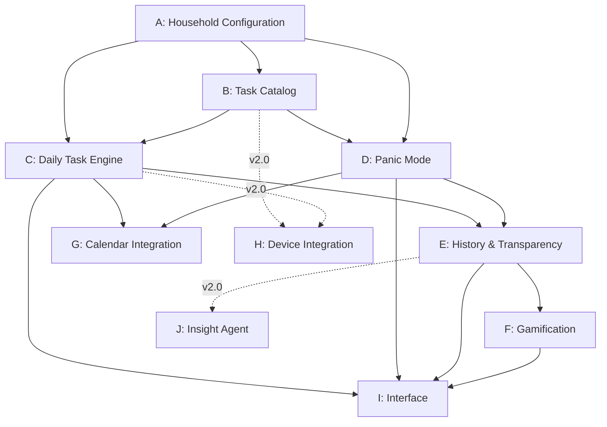

### Workflows

#### Area A — Household Configuration

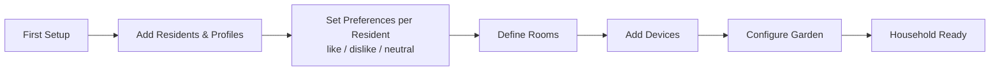

#### Area B — Task Catalog

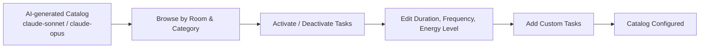

#### Area C — Daily Task Engine + Scoring

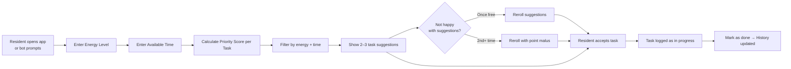

**Priority Score Formula:**
```
Score = Overdue Factor
      + Seasonality Factor
      + Imbalance Bonus
      - Rejection Malus (recovers over days)
      + Random Factor (wildcard)
      + Unpopular Task Bonus (if disliked by all residents)
```

**Unpopular Task Rules:**
- Score rises regardless of preference
- Rotation between residents — no one is permanently assigned
- No escape via reroll or delegation when overdue threshold is exceeded
- Bonus point modifier applied when completed voluntarily

#### Area D — Panic Mode

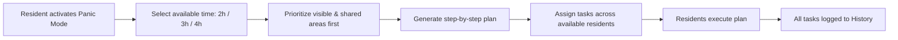

#### Area E — History, Transparency & Feedback Loop

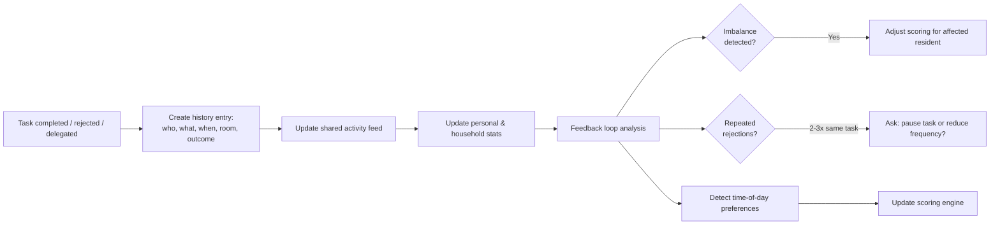

#### Area F — Gamification

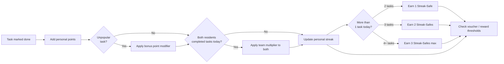

**Delegation Rules:**
- Delegating costs the sender points
- Receiver earns normal points on completion
- Only allowed if task is NOT in receiver's "dislike" category
- Receiver cannot decline
- Task is not re-rollable for receiver
- 3-day deadline for receiver
- After 3 days: only delegated task visible, no points awarded until completed

**Streak-Safe Rules:**
- 1 task/day → streak counted, no safe earned
- 2 tasks → streak + 1 streak-safe
- 3 tasks → streak + 2 streak-safes
- 4+ tasks → streak + 3 streak-safes (maximum per day)
- Streak-safes auto-apply on missed days
- No cap on streak length

#### Area G — Calendar Integration

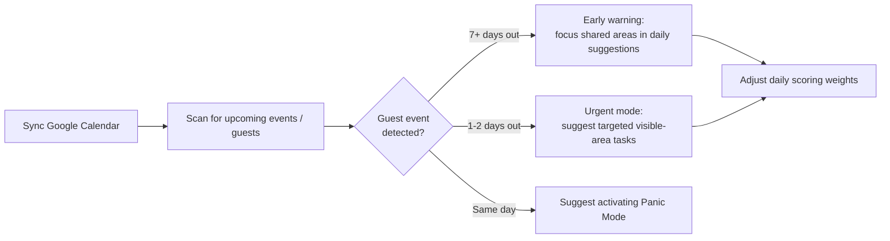

#### Area I — Interface

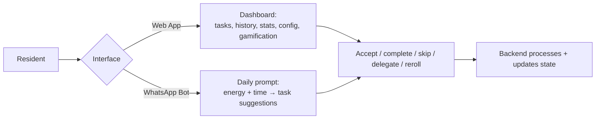

### Order
1. Round 1: Area A — Household Configuration
2. Round 2: Area B — Task Catalog (AI-generated via Claude)
3. Round 3: Area C — Daily Task Engine + Scoring Engine
4. Round 4: Area E — History, Transparency & Feedback Loop
5. Round 5: Area F — Gamification
6. Round 6: Area D — Panic Mode
7. Round 7: Area G — Calendar Integration
8. Round 8: Area I — Interface (Web App)
9. Round 9: Area I — Interface (WhatsApp Bot, optional)
10. Round 10: Area H — Device Integration (v2.0)
11. Round 11: Area J — Insight Agent (v2.0)

---

## Phase 3 — Technology

### Already in Use
- GreenNAS DXP2800 (home server, Docker-capable, 8GB DDR5 RAM)
- Google Calendar (shared calendars)
- Roborock Saros 10R (manual trigger in v1.0)
- Kärcher WV2

### Technology Decisions

| Layer | Technology | Rationale |
|-------|-----------|-----------|
| Backend / API | Python + FastAPI | Simple, well-documented, excellent for rule-based logic, highly AI-generatable |
| Database | SQLite (v1.0) | Zero-config, single file, no extra service, sufficient for household scale |
| Frontend | Vue.js + Vuetify | Gentle learning curve, beautiful UI components out of the box, AI-generatable |
| Deployment | Docker Compose | Single config file, easy to manage on GreenNAS, all services in one place |
| AI / Catalog Generation | Claude API (claude-sonnet) | One-time call at setup, cost-efficient, no local model needed |
| Calendar | Google Calendar API + OAuth2 | Direct integration, free, official |
| Bot Interface | WhatsApp Business API (v1.5) | Free up to 1,000 conversations/month, used daily by residents |
| Bot Interface alt. | Signal Bot (v2.0+) | Only when Signal API matures sufficiently |

### Design Principles
- **No AI at runtime** — all daily logic is rule-based (scoring engine, suggestions, gamification)
- **AI used once** — Claude API called once at setup to generate the task catalog, result stored in DB
- **Minimal services** — SQLite avoids a separate DB container; Docker Compose keeps everything manageable
- **Mobile-first web UI** — residents interact primarily on phone via browser, UX focus on speed and clarity
- **Offline-capable core** — task suggestions and history work without internet; only Calendar sync and Claude API require connectivity

### Agents Overview

| Agent | Area | Trigger | Technology |
|-------|------|---------|-----------|
| Catalog Agent | B | One-time at setup | Python + Claude API |
| Suggestion Agent | C | Daily per resident / on demand | Python, rule-based scoring |
| Panic Agent | D | Manual activation | Python, rule-based prioritization |
| Gamification Agent | F | Event-driven (task completed) | Python, rule-based |
| Calendar Agent | G | Scheduled background job (daily) | Python + Google Calendar API |
| Orchestrator | — | Routes all requests | FastAPI router layer |

### System Architecture

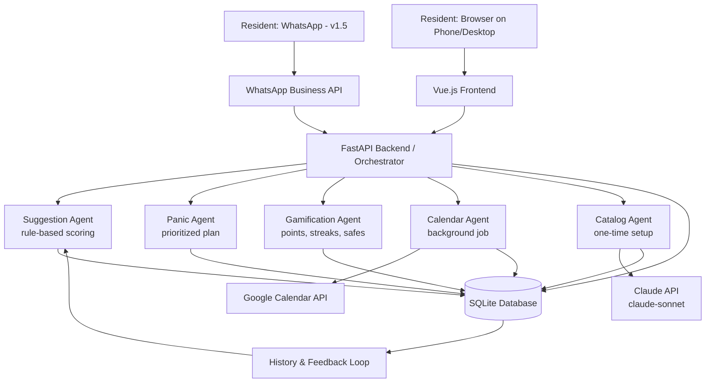

---

## Phase 4 — Implementation

### Rounds

| Round | Scope | Area | Agent Briefing | Status |
|-------|-------|------|---------------|--------|
| 1 | Project scaffolding: Docker Compose, FastAPI skeleton, SQLite setup, folder structure | Infrastructure | briefing-r1-scaffolding.md | ⬜ |
| 2 | Household Configuration: residents, rooms, devices, preferences, role + PIN fields | A | briefing-r2-configuration.md | ⬜ |
| 2b | Roles & Access Control: PIN verification, role guards on all endpoints, attempt throttling | A (ext.) | briefing-r2b-access-control.md | ⬜ |
| 3 | Task Catalog: Claude API integration, catalog generation, activate/deactivate | B | briefing-r3-catalog.md | ⬜ |
| 4 | Daily Task Engine: scoring engine, energy/time input, suggestion logic, reroll | C | briefing-r4-engine.md | ⬜ |
| 5 | History & Feedback Loop: task logging, activity feed, rejection tracking, imbalance detection | E | briefing-r5-history.md | ⬜ |
| 6 | Gamification: points, team multiplier, streaks, streak-safes, delegation, vouchers | F | briefing-r6-gamification.md | ⬜ |
| 7 | Panic Mode: activation flow, prioritized plan generation, multi-resident assignment | D | briefing-r7-panic.md | ⬜ |
| 8 | Calendar Integration: Google Calendar API, OAuth2, guest detection, scoring adjustments | G | briefing-r8-calendar.md | ⬜ |
| 9 | Web App UI: Vue.js + Vuetify frontend, all screens, mobile-first, PIN UI, role guards | I | briefing-r9-webapp.md | ⬜ |

### Timeline

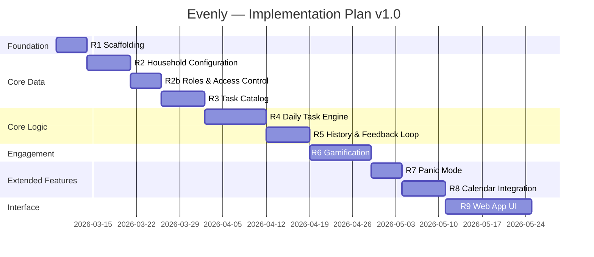
